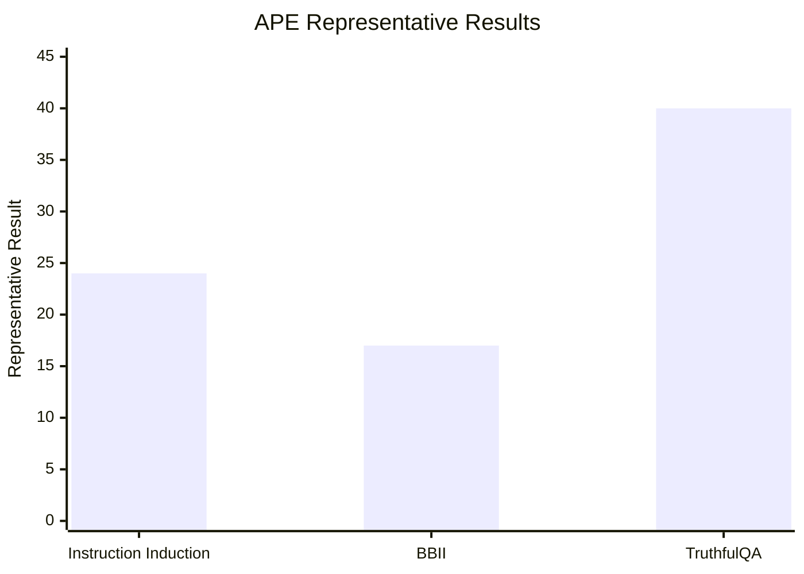

## Prompt Optimization Literature Review: APE

### Bibliographic Information

- **Title**: Large Language Models Are Human-Level Prompt Engineers
- **Authors**: Zhou et al.
- **Year**: 2022
- **Venue**: ICLR 2023
- **Core Topic**: automatic prompt engineering; instruction generation; prompt search

### 1. Prompt Optimization Strategy

APE is a **generate-evaluate-select** method. It asks an LLM to generate multiple instruction candidates, evaluates those candidates on held-out data, and keeps the best-performing prompt.

Optimization chain:

1. generate candidate instructions
2. run each candidate on held-out examples
3. score each candidate with a downstream metric
4. rank and select the best prompt

### 2. Biggest Innovation

APE's biggest innovation is that it **turns prompt engineering into an explicit optimization problem**. Instead of relying only on human intuition, it treats prompts as candidates that can be generated, compared, and selected automatically.

### 3. Metrics and How They Are Computed

APE mainly uses **execution accuracy**.

- **Execution Accuracy**

`Execution Accuracy = 1[M([prompt; question]) = gold answer]`

For aggregate comparisons across tasks, the paper also reports interquartile mean performance over task collections.

### 4. Datasets / Task Setting

APE is evaluated on three concrete settings rather than a vague family of tasks:

- **Instruction Induction benchmark**: 24 induction tasks, such as Antonyms, Cause Selection, Common Concept, Translation (`en-de`, `en-es`, `en-fr`), Word in Context, Sentiment, Synonyms, Rhymes, and Sentence Similarity.
- **BIG-Bench Instruction Induction (BBII)**: a filtered clean subset of **21 tasks** from BIG-Bench where each task has a human-written instruction and can be cast as instruction induction.
- **TruthfulQA**: used to test whether automatically generated instructions improve truthful and informative answering.

This is more precise than saying only “instruction-sensitive benchmark tasks,” because the paper really centers on **24 instruction-induction tasks + 21 BBII tasks + TruthfulQA**.

### 5. Benchmark Performance Summary

APE reports several concrete findings:

- On the **24 Instruction Induction tasks**, APE achieves **human-level or better performance on all 24/24 tasks** in zero-shot evaluation.
- On **BBII**, APE-generated prompts **match or improve over human prompts on 17 out of 21 tasks** in zero-shot performance.
- On **TruthfulQA**, APE achieves **over 40%** true-and-informative accuracy, compared with roughly **30%** for the human “help” prompt discussed in the paper.

| Benchmark | Baseline | APE Result |
|---|---|---|
| 24 Instruction Induction tasks | human-written instructions | human-level or better on 24/24 tasks |
| BBII (21 tasks) | human prompts | matches or improves on 17/21 tasks |
| TruthfulQA | human “help” prompt | >40% true+informative vs about 30% baseline |

Note: the three bars above are not on the same metric scale. They summarize three different concrete empirical claims from the paper: `24/24 tasks`, `17/21 tasks`, and `>40%` TruthfulQA performance.

### 6. Architecture / Conceptual Understanding

Read it as a three-stage pipeline:
- `Search object`: the natural-language instruction itself.
- `Feedback signal`: downstream task score on held-out examples.
- `Key novelty`: prompt engineering is reframed as candidate generation plus empirical selection.

### 7. Literature Value and Limitations

APE is foundational because it provides one of the earliest clean formulations of **automatic prompt search**. Its limitation is that it is much stronger at generating and selecting candidates than at explaining *why* one prompt is better than another.

