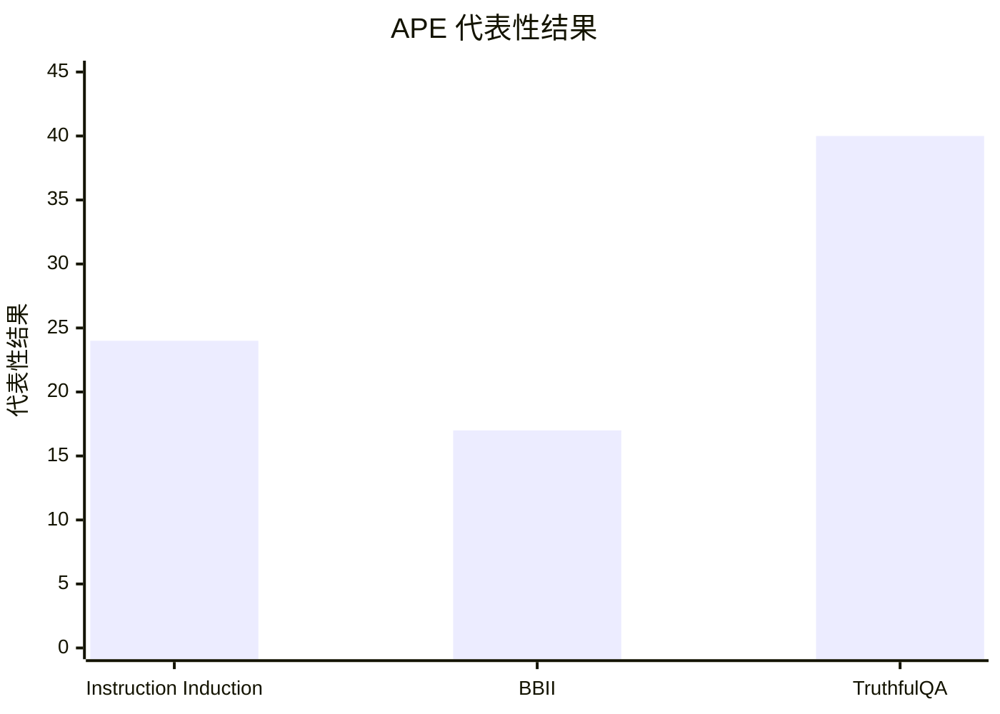

## Prompt 优化文献综述：APE

### 文献信息

- **题目**：Large Language Models Are Human-Level Prompt Engineers
- **作者**：Zhou 等
- **年份**：2022
- **会议**：ICLR 2023
- **核心主题**：automatic prompt engineering；instruction generation；prompt search

### 1. Prompt 优化策略

APE 属于典型的 **生成-评估-选择** 方法。它让 LLM 先生成多组 instruction 候选，再在 held-out 数据上评估这些候选，最后保留表现最好的 prompt。

优化链条是：

1. 自动生成 instruction 候选
2. 在 held-out examples 上运行每个候选
3. 用下游指标打分
4. 排序并选择最佳 prompt

### 2. 最大创新点

APE 最大的创新在于：它把 **prompt engineering 明确改写成了一个优化问题**。Prompt 不再只靠人工经验来写，而是可以像候选解一样被自动生成、比较和选择。

### 3. 指标评估及如何计算

APE 最核心的指标是 **execution accuracy**。

- **Execution Accuracy**

`Execution Accuracy = 1[M([prompt; question]) = gold answer]`

在跨任务汇总时，论文还使用 interquartile mean 来比较不同方法在任务集合上的整体表现。

### 4. 数据集 / 任务设置

APE 不是只在“泛泛的一批 benchmark tasks”上测试，而是主要在三类非常具体的设置上评估：

- **Instruction Induction benchmark**：共 **24 个任务**，包括 Antonyms、Cause Selection、Common Concept、Translation（`en-de`、`en-es`、`en-fr`）、Word in Context、Sentiment、Synonyms、Rhymes、Sentence Similarity 等。
- **BIG-Bench Instruction Induction（BBII）**：从 BIG-Bench 中筛出的 **21 个干净任务子集**，这些任务都具有明确的人类 instruction，适合做 instruction induction。
- **TruthfulQA**：用于测试自动生成 instruction 是否能提升回答的真实性与信息性。

因此，APE 的任务设置应当准确写成：**24 个 instruction induction 任务 + 21 个 BBII 任务 + TruthfulQA**，而不是只说“对 instruction 敏感的 benchmark tasks”。

### 5. Benchmark 效果总结

APE 的几个核心实证结果是：

- 在 **24 个 Instruction Induction 任务** 上，APE 在 zero-shot 评估中达到 **24/24 全部任务达到 human-level 或更好**。
- 在 **BBII 的 21 个任务** 上，APE 生成的 prompt 在 zero-shot 表现上 **17/21 个任务达到或超过人工 prompt**。
- 在 **TruthfulQA** 上，APE 达到 **超过 40%** 的 true-and-informative accuracy，而论文中对比的人类 “help” prompt 大约是 **30%**。

| Benchmark | 基线 | APE 结果 |
|---|---|---|
| 24 个 Instruction Induction 任务 | 人工 instruction | 24/24 达到 human-level 或更好 |
| BBII（21 任务） | 人工 prompt | 17/21 任务达到或超过 |
| TruthfulQA | 人类 “help” prompt | `>40%` true+informative，对比基线约 `30%` |

说明：这三根柱子不是同一量纲，分别表示 `24/24 任务`、`17/21 任务` 与 `>40%` TruthfulQA 表现，用来直观展示论文中最核心的三个具体结果。

### 6. Architecture / 帮助理解的结构

把它读成三段就清楚了：
- `搜索对象`：被优化的是自然语言 instruction，不是模型参数。
- `反馈信号`：held-out 样例上的下游任务分数。
- `核心创新`：把 prompt engineering 改写成“候选生成 + 经验筛选”的优化问题。

### 7. 文献价值与局限

APE 的价值在于奠定了 **automatic prompt search** 的基本范式。它的局限是更擅长生成和筛选候选，而不擅长解释为什么某个 prompt 更好。
