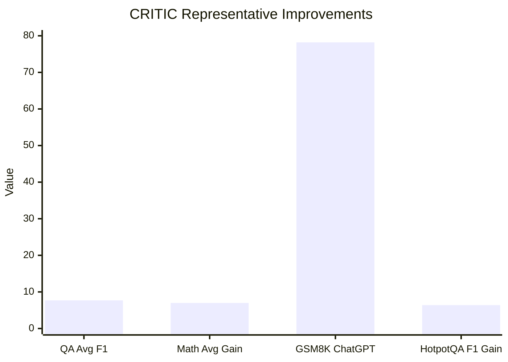

## Prompt Optimization Literature Review: CRITIC

### Bibliographic Information

- **Title**: CRITIC: Large Language Models Can Self-Correct with Tool-Interactive Critiquing
- **Authors**: Gou et al.
- **Year**: 2024
- **Venue**: ICLR 2024
- **Core Topic**: grounded critique; tool-interactive self-correction

### 1. Prompt Optimization Strategy

CRITIC introduces a **tool-grounded critique loop**:

1. generate an initial output
2. call a verifier or external tool
3. produce critique based on evidence
4. revise the output or response policy

### 2. Biggest Innovation

The biggest innovation of CRITIC is that it shows **critique quality improves when critique is externally grounded**.

### 3. Metrics and How They Are Computed

CRITIC uses task-specific metrics:

- **EM / F1** for question answering
- **Solve Rate / Accuracy** for mathematical program synthesis
- **Toxicity probability**, **max toxicity**, **perplexity**, **dist-2/dist-3** for detoxification

Examples:

`F1 = harmonic mean of precision and recall over answer overlap`

`Solve Rate = solved examples / total examples`

### 4. Datasets / Task Setting

CRITIC is evaluated on three concrete task families.

**A. Free-form QA**
- **AmbigNQ**
- **TriviaQA**
- **HotpotQA**
- Due to budget constraints, the paper samples **500 validation examples per dataset**.

**B. Mathematical program synthesis**
- **GSM8K**
- **SVAMP**
- **TabMWP**
- official test splits are used

**C. Toxicity reduction**
- **RealToxicityPrompts**
- the paper randomly samples **1,000 prompts**
- toxicity is scored with the **Perspective API**

### 5. Benchmark Performance Summary

CRITIC provides strong concrete numbers, especially for ChatGPT:

- Across the three QA datasets, CRITIC gives **+7.7 F1** on average.
- Across the three mathematical reasoning / program-synthesis datasets, it gives **+7.0% absolute gain**.
- On detoxification, it achieves a **79.2% reduction in toxicity probability**.

Representative task-level examples from the paper include:

- **AmbigNQ / ReAct -> ReAct+CRITIC**: `61.2 F1 -> 66.7 F1`
- **HotpotQA / ReAct -> ReAct+CRITIC**: `47.9 F1 -> 54.3 F1`
- **ChatGPT on GSM8K / PoT -> +CRITIC**: `72.5 -> 78.2`
- **Text-Davinci-003 on GSM8K / PoT -> +CRITIC**: `70.1 -> 71.2`
- **Toxicity reduction**: average toxicity probability drops from roughly `0.339` to `0.173` in the reported table slice

| Task Family | Concrete Result |
|---|---|
| QA (3 datasets) | +7.7 F1 on average |
| Math / Program synthesis (3 datasets) | +7.0% absolute |
| Detoxification | 79.2% reduction in toxicity probability |
| GSM8K / ChatGPT | 72.5 -> 78.2 |
| HotpotQA F1 | 47.9 -> 54.3 |

Note: the third bar is a final score, while the others are gains; it is included to keep one concrete benchmark number visible.

### 6. Architecture / Conceptual Understanding

Read the method as an evidence-grounded repair loop:
- `Optimization target`: the model output for the current task.
- `Feedback signal`: tool-backed evidence rather than free-form self-reflection alone.
- `Key novelty`: criticism is anchored in external checks before revision.

### 7. Literature Value and Limitations

CRITIC is highly relevant when a project risks **hallucinated critique**. Its limitation is that it depends on the availability of verifiers or tools.

