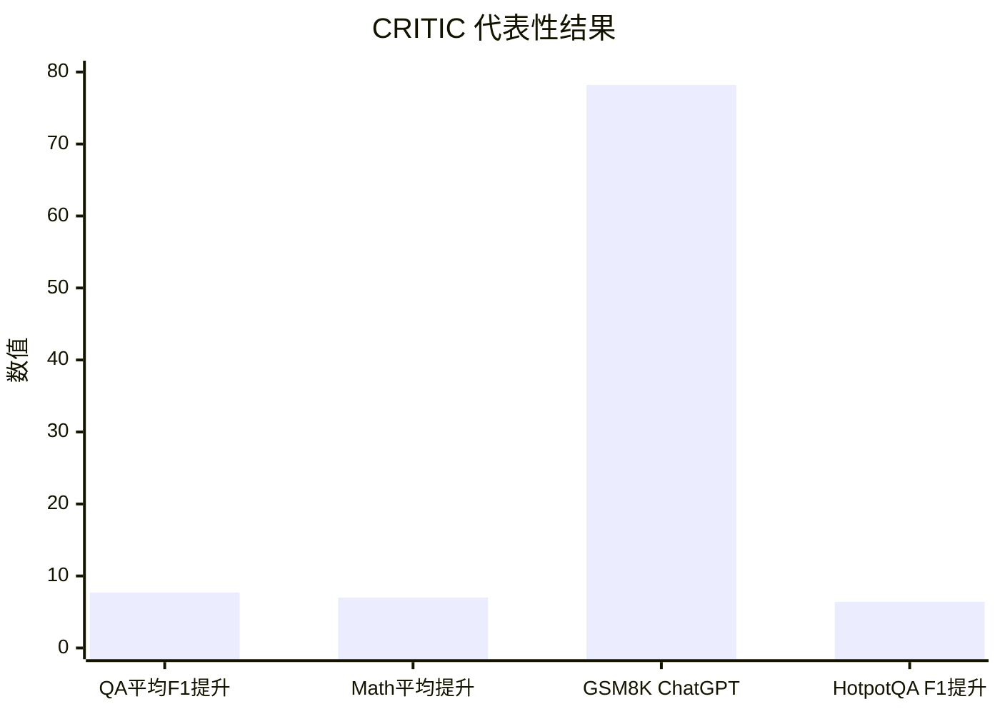

## Prompt 优化文献综述：CRITIC

### 文献信息

- **题目**：CRITIC: Large Language Models Can Self-Correct with Tool-Interactive Critiquing
- **作者**：Gou 等
- **年份**：2024
- **会议**：ICLR 2024
- **核心主题**：grounded critique；tool-interactive self-correction

### 1. Prompt 优化策略

CRITIC 的核心是一个 **基于工具证据的 critique 回路**：

1. 生成初始输出
2. 调用 verifier 或外部工具
3. 基于证据生成 critique
4. 再修订输出或响应策略

### 2. 最大创新点

CRITIC 最大的创新在于：它说明了 **critique 一旦有外部证据支撑，质量会显著提高**。

### 3. 指标评估及如何计算

CRITIC 按任务族使用不同指标：

- QA 用 **EM / F1**
- 数学程序合成用 **Solve Rate / Accuracy**
- detoxification 用 **toxicity probability**、**max toxicity**、**perplexity**、**dist-2/dist-3**

例如：

`F1 = 精确率与召回率的调和平均`

`Solve Rate = 解对样本数 / 总样本数`

### 4. 数据集 / 任务设置

CRITIC 实际评估在三类非常具体的任务上。

**A. Free-form QA**
- **AmbigNQ**
- **TriviaQA**
- **HotpotQA**
- 由于预算限制，论文在每个 QA 数据集上随机抽取 **500 个 validation examples**

**B. Mathematical program synthesis**
- **GSM8K**
- **SVAMP**
- **TabMWP**
- 使用各自官方 test split

**C. Toxicity reduction**
- **RealToxicityPrompts**
- 随机采样 **1,000 个 prompts**
- 用 **Perspective API** 计算 toxicity

### 5. Benchmark 效果总结

CRITIC 的 benchmark 结果其实很具体，尤其是在 ChatGPT 上：

- 在 3 个 QA 数据集上，CRITIC 平均带来 **+7.7 F1**。
- 在 3 个数学程序合成 / 数学推理数据集上，平均带来 **+7.0% 绝对提升**。
- 在 detoxification 任务上，达到 **79.2% 的 toxicity probability 降幅**。

论文中的一些任务级具体结果包括：

- **AmbigNQ / ReAct -> ReAct+CRITIC**：`61.2 F1 -> 66.7 F1`
- **HotpotQA / ReAct -> ReAct+CRITIC**：`47.9 F1 -> 54.3 F1`
- **ChatGPT on GSM8K / PoT -> +CRITIC**：`72.5 -> 78.2`
- **Text-Davinci-003 on GSM8K / PoT -> +CRITIC**：`70.1 -> 71.2`
- **Toxicity reduction**：表中一个代表性切片显示平均 toxicity probability 大约从 `0.339` 降到 `0.173`

| 任务族 | 代表性结果 |
|---|---|
| QA（3 数据集） | 平均 +7.7 F1 |
| 数学 / Program synthesis（3 数据集） | 平均 +7.0% 绝对提升 |
| Detoxification | toxicity probability 降低 79.2% |
| GSM8K / ChatGPT | 72.5 -> 78.2 |
| HotpotQA F1 | 47.9 -> 54.3 |

说明：第三根柱子是最终分数，其余主要是提升量，所以并非统一量纲，只是为了在图里保留一个可直接引用的具体 benchmark 数字。

### 6. Architecture / 帮助理解的结构

把它看成“有证据支撑的修复闭环”：
- `优化对象`：当前任务输出，而不是 prompt 本身。
- `反馈信号`：外部工具返回的可核对证据。
- `核心创新`：先验证、再批评、再修改，避免空泛自我反思。

### 7. 文献价值与局限

CRITIC 对任何存在 **hallucinated critique 风险** 的项目都非常有参考价值。它的局限是依赖 verifier 或工具的可用性。
