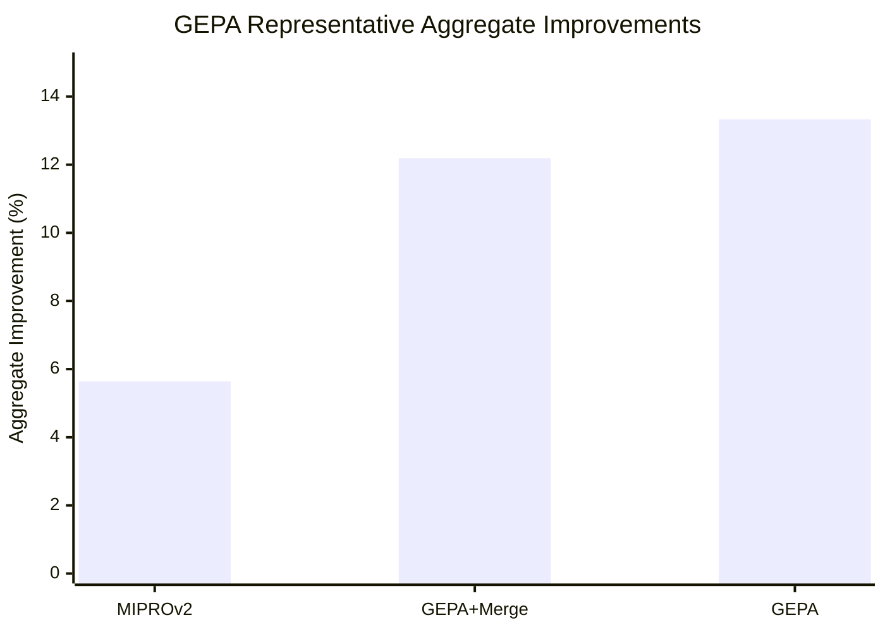

## Prompt Optimization Literature Review: GEPA

### Bibliographic Information

- **Title**: GEPA: Reflective Prompt Evolution Can Outperform Reinforcement Learning
- **Authors**: Agrawal et al.
- **Year**: 2025
- **Venue**: ICLR 2026 Oral / arXiv preprint
- **Core Topic**: reflective prompt evolution; compound AI systems; multi-objective optimization

### 1. Prompt Optimization Strategy

GEPA is a **reflective evolutionary optimizer** for prompt-based systems. It treats prompt optimization as repeated cycles of execution, trajectory collection, reflective diagnosis, prompt mutation, and Pareto-style selection.

### 2. Biggest Innovation

Its biggest innovation is combining **reflection** with **evolutionary selection**. GEPA does not only know which candidate scored well; it also reasons about why a candidate performed well or poorly before generating the next generation of prompts.

### 3. Metrics and How They Are Computed

GEPA uses each benchmark's native task score and then reports aggregate improvement over baseline:

`Aggregate Improvement = (Optimized Aggregate Score - Baseline Aggregate Score) / Baseline Aggregate Score`

Depending on the benchmark, the native metric may be accuracy, pass@1, or benchmark-specific task score.

### 4. Datasets / Task Setting

GEPA is evaluated on **6 concrete benchmarks**, each paired with a compound AI system:

- **HotpotQA**: multi-hop reasoning
- **IFBench**: instruction following
- **HoVer**: retrieval-augmented verification / fact checking
- **PUPA**: privacy-aware delegation
- **AIME-2025**: math competition benchmark
- **LiveBench-Math**: math reasoning benchmark

The paper evaluates with both **Qwen3 8B** and **GPT-4.1 Mini** systems.

### 5. Benchmark Performance Summary

GEPA provides much more specific evidence than a generic “better than RL” statement:

- Across all benchmarks and models, **GEPA achieves +13.33% aggregate improvement**, compared with **+5.64% for MIPROv2**.
- The closely related GEPA+Merge variant reports **+12.19% aggregate improvement**.
- On **IFBench with Qwen3 8B**, GEPA finds strong prompts after only **678 rollouts**, reaching **38.61%**, while **GRPO** reaches **35.88%** using **24,000 rollouts**.
- On **AIME-2025**, the paper highlights about **+12% accuracy over MIPROv2**.
- On **HotpotQA with Qwen3 8B**, a table in the paper shows:
  - **Baseline**: `42.33`
  - **MIPROv2**: `55.33`
  - **GEPA**: `62.33`
- On the Qwen3 8B aggregate comparison over HotpotQA / IFBench / HoVer / PUPA, GEPA yields **+12.44% aggregate improvement**, beating greedy selection (`+6.05%`) and beam-search selection (`+5.11%`).

| Benchmark Slice | Baseline / Comparator | GEPA Result |
|---|---|---|
| All benchmarks + models | MIPROv2 +5.64% | GEPA +13.33% |
| IFBench / Qwen3 8B | GRPO 35.88 with 24k rollouts | GEPA 38.61 with 678 rollouts |
| HotpotQA / Qwen3 8B | 42.33 baseline | 62.33 |
| Candidate selection study | greedy +6.05 / beam +5.11 | GEPA +12.44 |

### 6. Architecture / Conceptual Understanding

The easiest reading is ?run, inspect traces, evolve prompts?:
- `Search object`: multi-part prompt configurations for a compound system.
- `Feedback signal`: traces plus task scores, not only final accuracy.
- `Key novelty`: reflective analysis is used to drive evolution over structured prompt programs.

### 7. Literature Value and Limitations

GEPA is important for projects that need **system-level prompt optimization** beyond single-turn prompt editing. Its limitation is that reflective evolution can still be expensive and depends on the quality of the reflection process itself.

