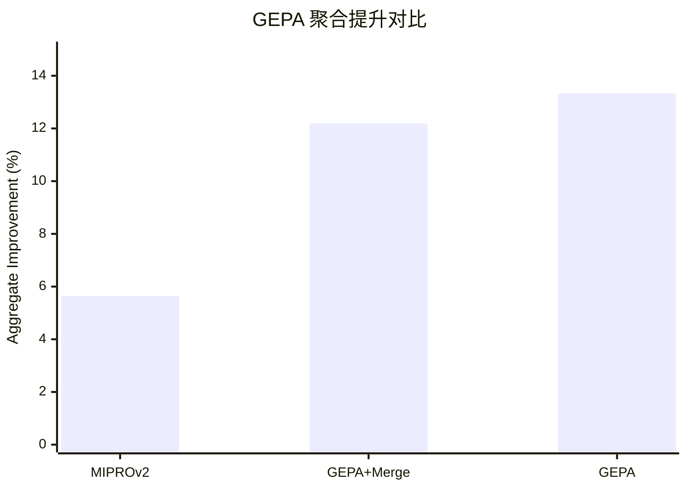

## Prompt 优化文献综述：GEPA

### 文献信息

- **题目**：GEPA: Reflective Prompt Evolution Can Outperform Reinforcement Learning
- **作者**：Agrawal 等
- **年份**：2025
- **发表形式**：ICLR 2026 Oral / arXiv preprint
- **核心主题**：reflective prompt evolution；compound AI systems；multi-objective optimization

### 1. Prompt 优化策略

GEPA 是一个 **反思式进化优化器**。它把 prompt optimization 看成执行、轨迹收集、反思诊断、prompt 变异与 Pareto 风格选择的循环过程。

### 2. 最大创新点

GEPA 最大的创新在于：把 **reflection** 和 **evolutionary selection** 结合起来。它不只是知道哪个候选分数高，还会在生成下一代 prompt 之前试图理解为什么某个候选好或差。

### 3. 指标评估及如何计算

GEPA 以各 benchmark 的原生 task score 为基础，再汇总成 aggregate improvement：

`Aggregate Improvement = (优化后聚合分数 - 基线聚合分数) / 基线聚合分数`

不同 benchmark 的底层指标可能是 accuracy、pass@1，或者 benchmark 自身定义的任务分数。

### 4. 数据集 / 任务设置

GEPA 实际评估在 **6 个非常具体的 benchmarks** 上，并且每个 benchmark 都对应一个 compound AI system：

- **HotpotQA**：multi-hop reasoning
- **IFBench**：instruction following
- **HoVer**：retrieval-augmented verification / fact checking
- **PUPA**：privacy-aware delegation
- **AIME-2025**：数学竞赛 benchmark
- **LiveBench-Math**：数学推理 benchmark

论文同时在 **Qwen3 8B** 和 **GPT-4.1 Mini** 两类系统上测试。

### 5. Benchmark 效果总结

GEPA 的结果远不止一句“比 RL 好”：

- 在所有 benchmarks 和 models 上，**GEPA 的 aggregate improvement 为 +13.33%**，而 **MIPROv2 只有 +5.64%**。
- 与之接近的 **GEPA+Merge** 也达到 **+12.19%**。
- 在 **IFBench + Qwen3 8B** 上，GEPA 只用 **678 rollouts** 就找到强 prompt，达到 **38.61%**；而 **GRPO** 用 **24,000 rollouts** 只有 **35.88%**。
- 在 **AIME-2025** 上，论文特别强调相对 MIPROv2 约有 **+12% accuracy** 的优势。
- 在 **HotpotQA + Qwen3 8B** 上，论文表格给出：
  - **Baseline**：`42.33`
  - **MIPROv2**：`55.33`
  - **GEPA**：`62.33`
- 在 Qwen3 8B 的 HotpotQA / IFBench / HoVer / PUPA 聚合比较中，GEPA 的 **aggregate improvement 为 +12.44%**，高于 greedy selection 的 `+6.05%` 和 beam-search 的 `+5.11%`。

| Benchmark 切片 | 对照 | GEPA 结果 |
|---|---|---|
| 全 benchmark + 全模型 | MIPROv2 为 +5.64% | GEPA 为 +13.33% |
| IFBench / Qwen3 8B | GRPO：35.88，24k rollouts | GEPA：38.61，678 rollouts |
| HotpotQA / Qwen3 8B | baseline 42.33 | GEPA 62.33 |
| 候选选择策略比较 | greedy +6.05 / beam +5.11 | GEPA +12.44 |

### 6. Architecture / 帮助理解的结构

最容易的读法是“运行、看轨迹、再进化”：
- `搜索对象`：复合系统里的多段 prompt 配置。
- `反馈信号`：执行轨迹与任务分数同时参与判断。
- `核心创新`：不是只看终分，而是利用 traces 做反思式进化。

### 7. 文献价值与局限

GEPA 对需要 **系统级 prompt optimization** 的项目非常重要。它的局限在于：反思式进化成本可能较高，而且依赖 reflection 过程本身的质量。
