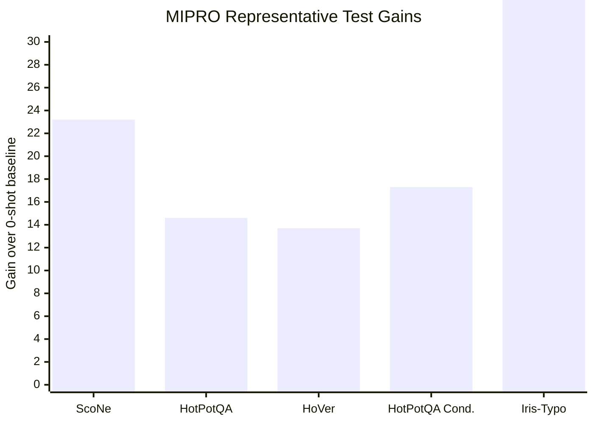

## Prompt Optimization Literature Review: MIPRO

### Bibliographic Information

- **Title**: Optimizing Instructions and Demonstrations for Multi-Stage Language Model Programs
- **Authors**: Krista Opsahl-Ong, Michael J. Ryan, Josh Purtell, David Broman, Christopher Potts, Matei Zaharia, Omar Khattab
- **Year**: 2024
- **Venue**: EMNLP 2024
- **DOI**: 10.18653/v1/2024.emnlp-main.525

### 1. Prompt Optimization Strategy

MIPRO is a **multi-stage joint optimizer** for language-model programs. It jointly optimizes:
- module instructions
- few-shot demonstrations
- full program-level prompt configurations

Its optimization pipeline is:
1. decompose the LM program into modules
2. bootstrap demonstration candidates
3. generate instruction candidates with grounded proposal strategies
4. evaluate candidate configurations on stochastic minibatches
5. fit a Bayesian surrogate model over program-level performance
6. search for high-performing instruction/demo combinations under a fixed budget

### 2. Biggest Innovation

MIPRO’s main innovation is that it explicitly addresses **credit assignment in multi-stage LM programs**. Instead of optimizing one prompt in isolation, it treats the entire LM program as the optimization target and uses a surrogate model to reason about which module-level choices improve downstream program performance.

### 3. Metrics and How They Are Computed

The paper uses task-level metrics because the goal is to optimize the **whole program**, not intermediate module outputs. The core metrics in the benchmark include:
- **Exact Match**
- **Accuracy**
- **Recall@21**
- a **custom metric** for HotPotQA Conditional

Typical classification-style metrics are computed as:

`Accuracy = Number of correct outputs / Total number of examples`

For retrieval-style tasks, the paper uses task-specific retrieval metrics such as `Recall@21`.

The important point is that MIPRO optimizes a **system-level downstream score**, which can be written abstractly as:

`Program Score = f(all module prompts, demonstrations, final program output)`

### 4. Datasets / Task Setting

MIPRO evaluates on a benchmark of **7 diverse LM programs**. The paper states that it uses:
- **500 training examples**
- **500 development examples**
- **2,000 test examples** (or the full test set if smaller)

The 7 benchmark tasks are:

| Task | Task Type | Program | Modules | LM Calls | Metric |
|---|---|---|---:|---:|---|
| HotPotQA | Multi-Hop QA | Multi-Hop Retrieval | 2 | 3 | Exact Match |
| HotPotQA Conditional | Multi-Hop QA | Multi-Hop Retrieval | 2 | 3 | Custom |
| Iris | Classification | Chain of Thought | 1 | 1 | Accuracy |
| Iris-Typo | Classification | Chain of Thought | 1 | 1 | Accuracy |
| Heart Disease | Classification | Answer Ensemble | 2 | 4 | Accuracy |
| ScoNe | Natural Language Inference | Chain of Thought | 1 | 1 | Exact Match |
| HoVer | Multi-Hop Claim Verification | Multi-Hop Retrieval | 4 | 4 | Recall@21 |

This benchmark is important because it spans both **single-stage** and **multi-stage** LM programs, with different metrics and different forms of prompt coupling.

### 5. Benchmark Performance Summary

The abstract-level headline is already concrete: **MIPRO outperforms baselines on 5 of 7 programs, by as much as 13% accuracy, using Llama3-8B as the task model.**

The paper’s main result table is even more specific. Averaged across 5 runs, the **test** scores are:

| Optimizer | ScoNe | HotPotQA | HoVer | HotPotQA Cond. | Iris | Iris-Typo | Heart Disease |
|---|---:|---:|---:|---:|---:|---:|---:|
| 0-shot baseline | 56.2 | 31.8 | 25.3 | 6.0 | 40.9 | 32.0 | 26.8 |
| 0-Shot MIPRO | 71.5 | 36.8 | 33.1 | 14.6 | 36.4 | 56.7 | 25.8 |
| Bootstrap RS | 75.4 | 45.8 | 37.2 | 10.4 | 94.1 | 58.7 | 79.2 |
| **MIPRO** | **79.4** | **46.4** | **39.0** | **23.3** | 88.6 | **68.7** | 74.2 |

This table makes the paper’s conclusions much more rigorous:
- MIPRO is strongest overall on **ScoNe, HotPotQA, HoVer, HotPotQA Conditional, and Iris-Typo**
- demonstration optimization alone is already very strong on some tasks
- joint optimization is especially valuable when modules interact or when instruction quality matters for task rules

The paper’s own discussion extracts five lessons, including:
- optimizing bootstrapped demonstrations is often essential
- optimizing both instructions and demonstrations generally works best
- instruction optimization matters most when tasks have **conditional rules**

### 6. Architecture / Conceptual Understanding

Read MIPRO as a structured optimizer over prompt programs:
- `Search object`: both instructions and demonstration sets.
- `Feedback signal`: mini-batch task performance summarized through Bayesian optimization.
- `Key novelty`: demo search and instruction search are coupled instead of tuned separately.

### 7. Literature Value and Limitations

MIPRO is one of the most important references for **multi-module prompt optimization** because it goes beyond single-prompt search and treats prompt optimization as a full-program problem.

Its main limitation is that it focuses on search efficiency and program-level credit assignment, not on grounded textual explanation or faithful natural-language rationales for why a prompt update works.

