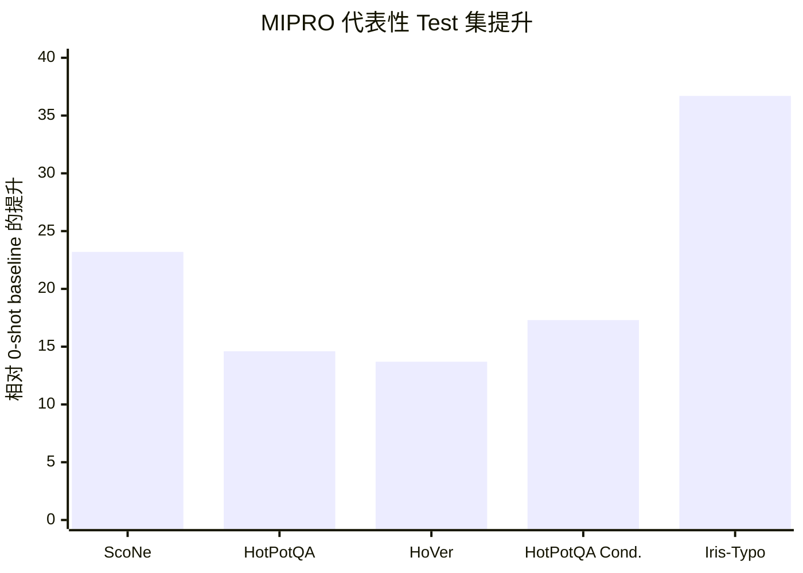

## Prompt 优化文献综述：MIPRO

### 文献信息

- **题目**：Optimizing Instructions and Demonstrations for Multi-Stage Language Model Programs
- **作者**：Krista Opsahl-Ong, Michael J. Ryan, Josh Purtell, David Broman, Christopher Potts, Matei Zaharia, Omar Khattab
- **年份**：2024
- **会议**：EMNLP 2024
- **DOI**：10.18653/v1/2024.emnlp-main.525

### 1. Prompt 优化策略

MIPRO 是一个 **多阶段联合优化器**，优化对象不是单个 prompt，而是整个 language model program。它联合优化：
- 模块 instructions
- few-shot demonstrations
- 整体 program-level 配置

它的优化流程是：
1. 把 LM program 拆成多个模块
2. 为每个模块 bootstrap demonstration 候选
3. 用 grounded proposal 策略生成 instruction 候选
4. 在 stochastic minibatches 上评估候选配置
5. 用 Bayesian surrogate model 学习 program-level 性能分布
6. 在固定预算下搜索更优的 instruction/demo 组合

### 2. 最大创新点

MIPRO 最大的创新在于：它明确处理了 **multi-stage LM programs 中的 credit assignment 问题**。也就是说，它不是把每个模块各自独立调 prompt，而是把整个程序的最终效果当作优化目标，再由 surrogate model 反推出哪些模块级选择更有价值。

### 3. 指标评估及如何计算

MIPRO 关注的是 **整个程序的下游表现**，因此使用的是 task-level 指标，而不是中间模块标签。论文 benchmark 中直接用到的指标包括：
- **Exact Match**
- **Accuracy**
- **Recall@21**
- HotPotQA Conditional 的 **custom metric**

典型分类指标可写成：

`Accuracy = 正确输出数 / 总样本数`

对于检索类任务，则用相应检索指标，例如 `Recall@21`。

更抽象地说，MIPRO 优化的是：

`Program Score = f(所有模块 prompt, demonstrations, 最终程序输出)`

### 4. 数据集 / 任务设置

MIPRO 在一个 **7 个 LM programs** 的 benchmark 上评估。论文明确说明使用：
- **500 个训练样本**
- **500 个开发样本**
- **2,000 个测试样本**（如果原始测试集更小，则用完整测试集）

7 个任务与程序设置如下：

| 任务 | 任务类型 | Program | Modules | LM Calls | Metric |
|---|---|---|---:|---:|---|
| HotPotQA | Multi-Hop QA | Multi-Hop Retrieval | 2 | 3 | Exact Match |
| HotPotQA Conditional | Multi-Hop QA | Multi-Hop Retrieval | 2 | 3 | Custom |
| Iris | Classification | Chain of Thought | 1 | 1 | Accuracy |
| Iris-Typo | Classification | Chain of Thought | 1 | 1 | Accuracy |
| Heart Disease | Classification | Answer Ensemble | 2 | 4 | Accuracy |
| ScoNe | Natural Language Inference | Chain of Thought | 1 | 1 | Exact Match |
| HoVer | Multi-Hop Claim Verification | Multi-Hop Retrieval | 4 | 4 | Recall@21 |

这个 benchmark 的价值在于：它同时覆盖了 **single-stage** 和 **multi-stage** 程序，而且不同任务的 prompt 耦合方式并不相同。

### 5. Benchmark 效果总结

论文摘要给出的 headline 已经比较具体：**MIPRO 在 7 个程序中的 5 个上超过 baseline optimizers，最大可带来 13% accuracy 提升，任务模型使用的是 Llama3-8B。**

主结果表更具体。对 5 次运行取平均后，**test** 集结果为：

| Optimizer | ScoNe | HotPotQA | HoVer | HotPotQA Cond. | Iris | Iris-Typo | Heart Disease |
|---|---:|---:|---:|---:|---:|---:|---:|
| 0-shot baseline | 56.2 | 31.8 | 25.3 | 6.0 | 40.9 | 32.0 | 26.8 |
| 0-Shot MIPRO | 71.5 | 36.8 | 33.1 | 14.6 | 36.4 | 56.7 | 25.8 |
| Bootstrap RS | 75.4 | 45.8 | 37.2 | 10.4 | 94.1 | 58.7 | 79.2 |
| **MIPRO** | **79.4** | **46.4** | **39.0** | **23.3** | 88.6 | **68.7** | 74.2 |

这张表能支撑比“5/7 获胜”更严谨的结论：
- MIPRO 在 **ScoNe、HotPotQA、HoVer、HotPotQA Conditional、Iris-Typo** 上是最强的
- 仅优化 demonstrations 在部分任务上已经很强
- 但当模块之间强耦合、或任务规则更复杂时，联合优化 instruction + demonstrations 更有价值

论文 discussion 进一步总结出几条经验：
- bootstrapped demonstrations 往往非常关键
- instruction 和 demonstration 联合优化通常效果最好
- 当任务存在 **conditional rules** 时，instruction optimization 尤其重要

### 6. Architecture / 帮助理解的结构

把 MIPRO 看成“对 prompt program 做结构化搜索”：
- `搜索对象`：instruction 和 demonstrations 两部分一起优化。
- `反馈信号`：mini-batch 表现再交给 Bayesian optimization 汇总决策。
- `核心创新`：不是只调 instruction，也不是只调 demo，而是把两者耦合起来搜索。

### 7. 文献价值与局限

MIPRO 是 **多模块 prompt optimization** 最重要的参考文献之一，因为它真正把 prompt 优化提升到了“整个程序”的层级，而不只是单 prompt 搜索。

它的局限是：重点在搜索效率与程序级 credit assignment，而不是 grounded textual explanation，也不强调为什么某次 prompt 更新在语义上一定成立。
