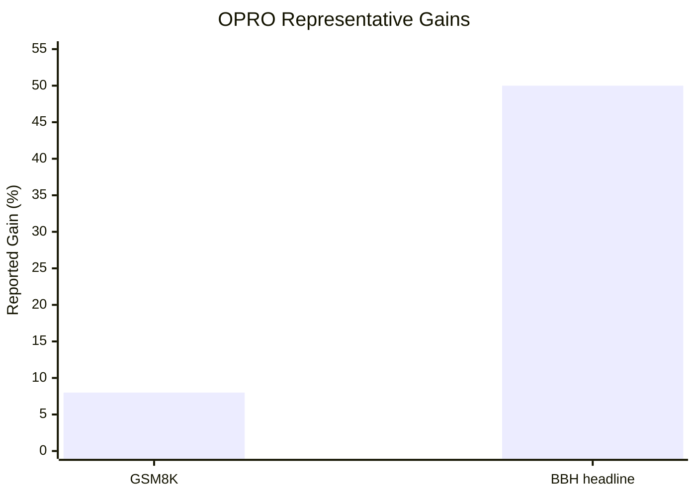

## Prompt Optimization Literature Review: OPRO

### Bibliographic Information

- **Title**: Large Language Models as Optimizers
- **Authors**: Chengrun Yang, Xuezhi Wang, Yifeng Lu, Hanxiao Liu, Quoc V. Le, Denny Zhou, Xinyun Chen
- **Year**: 2023
- **Venue**: arXiv preprint
- **DOI**: 10.48550/arXiv.2309.03409

### 1. Prompt Optimization Strategy

OPRO is a **history-based proposal optimization** framework. It treats the LLM as the optimizer itself: at each step, the LLM receives a meta-prompt containing previously generated solutions together with their scores, then proposes better new candidates.

The optimization loop is:
1. define the optimization objective in natural language
2. initialize candidate prompts or solutions
3. evaluate them externally
4. append candidate-score pairs to the history
5. ask the LLM to generate new candidates from that history
6. evaluate and append again until convergence or budget exhaustion

### 2. Biggest Innovation

The biggest innovation of OPRO is that it redefines the LLM as the **optimizer itself**, not merely the object being optimized. That is conceptually different from prompt-editing methods that only rewrite or locally perturb prompts.

### 3. Metrics and How They Are Computed

For prompt optimization tasks such as GSM8K and BBH, the main metric is:

- **Accuracy**

`Accuracy = Number of correct instances / Total number of instances`

For reporting gains over human-designed prompts, the review can express the result as:

`Relative Improvement = (OPRO Score - Human Prompt Score) / Human Prompt Score`

For general optimization tasks such as linear regression or TSP, the metric is the original task objective value itself, e.g. regression error or route length.

### 4. Datasets / Task Setting

OPRO is evaluated in two layers.

First, it is demonstrated on **general optimization problems**:
- **linear regression**
- **traveling salesman problem (TSP)**

Second, it is evaluated on **prompt optimization benchmarks**:
- **GSM8K**
- **Big-Bench Hard (BBH)**

The paper evaluates BBH across **23 tasks**. For BBH, it uses **20% of examples for prompt optimization** and the rest for testing. For GSM8K, the optimization objective is training accuracy computed on a small training set.

### 5. Benchmark Performance Summary

The main headline from the abstract is already concrete:
- on **GSM8K**, the best OPRO-optimized prompts outperform human-designed prompts by **up to 8%**
- on **BBH**, the gains reach **up to 50%** over human-designed prompts

The paper also provides concrete GSM8K results in `Table 1`:

| Source | Instruction | Test Accuracy |
|---|---|---:|
| Baseline | “Let’s think step by step.” | 71.8 |
| Baseline | “Let’s work this out in a step by step way...” | 58.8 |
| Baseline | empty string | 34.0 |
| OPRO (PaLM 2-L-IT optimizer) | “Take a deep breath and work on this problem step-by-step.” | **80.2** |
| OPRO (PaLM 2-L optimizer) | “Break this down.” | 79.9 |
| OPRO (gpt-3.5-turbo optimizer) | arithmetic/logical instruction | 78.5 |
| OPRO (gpt-4 optimizer) | numerical-command instruction | 74.5 |

So the GSM8K headline is not just “up to 8%”, but concretely **71.8 -> 80.2** for the strongest reported setup.

For BBH, the paper reports broader task-level improvements:
- with a **PaLM 2-L scorer**, OPRO-found instructions outperform “Let’s think step by step.” by more than **5% on 19 of 23 tasks**
- with a **text-bison scorer**, the same is true on **15 of 23 tasks**
- compared with the **empty-string** starting point, OPRO improves accuracy by more than **5% on 20 of 23 tasks** for PaLM 2-L and **15 of 23 tasks** for text-bison

This makes the benchmark story much more rigorous than simply saying OPRO “works well”: it shows both a concrete GSM8K result table and broad multi-task BBH gains.

### 6. Architecture / Conceptual Understanding

The method is best understood as ?optimization by natural-language proposals?:
- `Search object`: prompts or textual solutions.
- `Feedback signal`: scalar score returned by the evaluator.
- `Key novelty`: the optimizer itself is an LLM that reads optimization history and proposes the next candidate.

### 7. Literature Value and Limitations

OPRO is important because it shows that **scalar scores plus optimization history** can already support useful prompt optimization, without requiring gradient access or specialized model internals.

Its main limitation is that it is much better at proposing candidate updates than at explaining why those updates should work. It is therefore a strong optimization framework, but not a grounded explanation framework.

