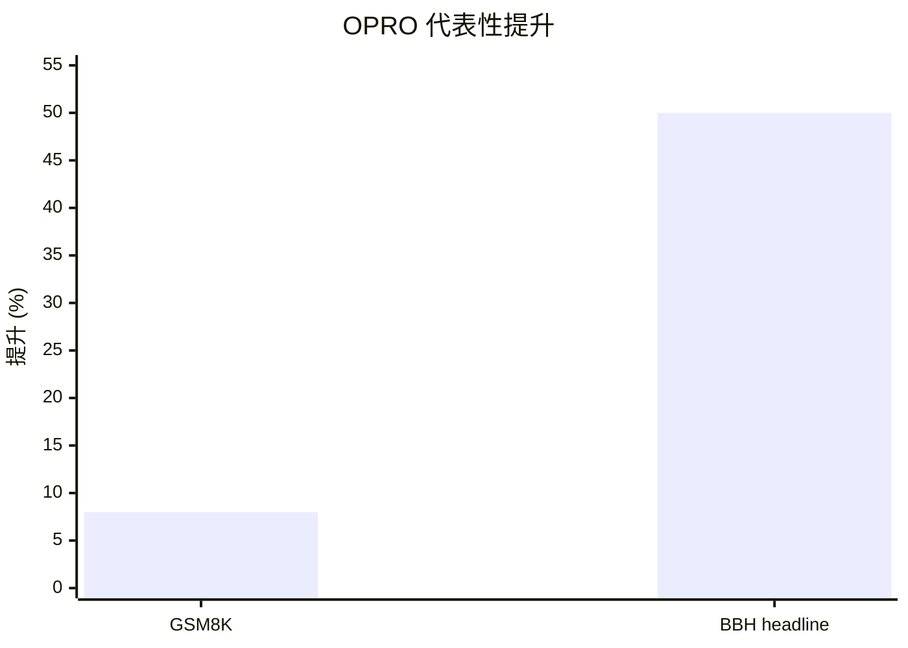

## Prompt 优化文献综述：OPRO

### 文献信息

- **题目**：Large Language Models as Optimizers
- **作者**：Chengrun Yang, Xuezhi Wang, Yifeng Lu, Hanxiao Liu, Quoc V. Le, Denny Zhou, Xinyun Chen
- **年份**：2023
- **发表形式**：arXiv preprint
- **DOI**：10.48550/arXiv.2309.03409

### 1. Prompt 优化策略

OPRO 是一个 **基于历史轨迹的 proposal optimization** 框架。它把 LLM 直接当作 optimizer：每一轮都给它一个 meta-prompt，其中包含历史候选解及其得分，再让它提出更优的新候选。

优化链条是：
1. 用自然语言定义优化目标
2. 初始化 prompt 或其他候选解
3. 用外部 evaluator 打分
4. 把候选及分数写回历史
5. 让 LLM 基于历史继续生成新候选
6. 重复评估与写回，直到收敛或预算耗尽

### 2. 最大创新点

OPRO 最大的创新在于：它把 LLM 的角色改写成了 **优化器本身**，而不只是被优化对象。这一点和只做 prompt 改写或局部编辑的方法有本质区别。

### 3. 指标评估及如何计算

在 GSM8K、BBH 这类 prompt optimization 任务中，核心指标是：

- **Accuracy**

`Accuracy = 正确样本数 / 总样本数`

如果需要表达相对人工 prompt 的提升，可写成：

`Relative Improvement = (OPRO 得分 - 人工 Prompt 得分) / 人工 Prompt 得分`

对于 linear regression、TSP 这样的通用优化任务，指标则是原始目标函数值本身，例如回归误差或路径长度。

### 4. 数据集 / 任务设置

OPRO 分两层做实验。

第一层是 **通用优化问题**：
- **linear regression**
- **traveling salesman problem (TSP)**

第二层是 **prompt optimization benchmark**：
- **GSM8K**
- **Big-Bench Hard (BBH)**

其中，BBH 使用了 **23 个子任务**。论文明确写到：
- 对 BBH，使用 **20% 样本做 prompt optimization**，其余样本做测试；
- 对 GSM8K，则用小规模训练集上的 accuracy 作为优化目标。

### 5. Benchmark 效果总结

摘要里的 headline 已经很具体：
- 在 **GSM8K** 上，最优 OPRO prompt 相比人工 prompt **最多提升 8%**
- 在 **BBH** 上，增益 **最高可达 50%**

除此之外，论文 `Table 1` 还给出了具体的 GSM8K 数值：

| 来源 | Instruction | Test Accuracy |
|---|---|---:|
| Baseline | “Let’s think step by step.” | 71.8 |
| Baseline | “Let’s work this out in a step by step way...” | 58.8 |
| Baseline | empty string | 34.0 |
| OPRO（PaLM 2-L-IT optimizer） | “Take a deep breath and work on this problem step-by-step.” | **80.2** |
| OPRO（PaLM 2-L optimizer） | “Break this down.” | 79.9 |
| OPRO（gpt-3.5-turbo optimizer） | arithmetic/logical instruction | 78.5 |
| OPRO（gpt-4 optimizer） | numerical-command instruction | 74.5 |

所以，GSM8K 的 benchmark 结论不应只写成“最多提升 8%”，而应更精确地写成：**最强设置把 GSM8K 从 71.8 提升到 80.2。**

对于 BBH，论文给出的结论也相当具体：
- 使用 **PaLM 2-L scorer** 时，OPRO 找到的 instruction 相比 “Let’s think step by step.”，在 **23 个任务中的 19 个** 上提升超过 **5%**
- 使用 **text-bison scorer** 时，这一现象出现在 **23 个任务中的 15 个**
- 相比 **empty string** 起点，PaLM 2-L 上有 **20/23** 个任务提升超过 **5%**，text-bison 上有 **15/23** 个任务提升超过 **5%**

这说明 OPRO 的效果不是只体现在某个单一 benchmark，而是有明确的多任务覆盖面。

### 6. Architecture / 帮助理解的结构

最好的理解方式是“让语言模型自己做优化器”：
- `搜索对象`：prompt 或其他文本候选解。
- `反馈信号`：外部评估器返回的标量分数。
- `核心创新`：LLM 不只是生成答案，而是读取历史搜索轨迹来提出下一步候选。

### 7. 文献价值与局限

OPRO 的价值在于，它证明了：仅靠 **标量得分 + 历史轨迹**，就已经可以支撑有效的 prompt optimization，而不需要梯度访问或复杂模型内部信息。

它的局限是：更擅长提出候选，而不擅长解释为什么这个更新一定有效。因此，它是一个很强的优化框架，但不是 grounded explanation 框架。
