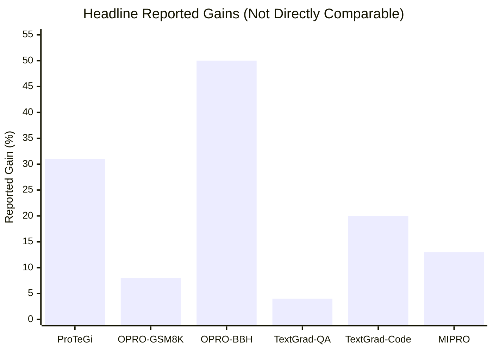
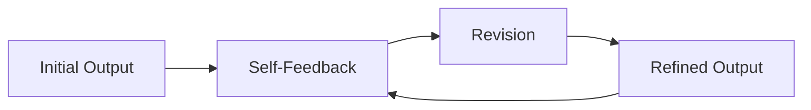
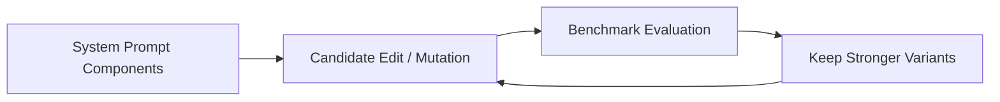
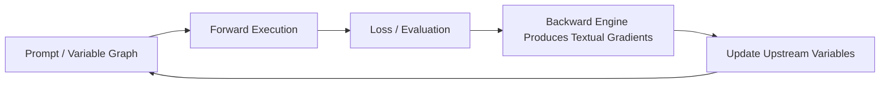
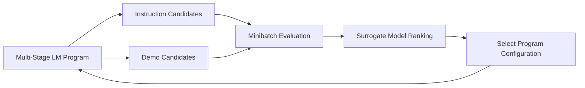
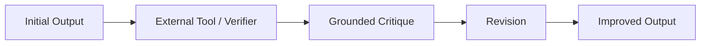

# Survey of Prompt Optimization Literature

## Scope

This survey consolidates the prompt-optimization papers already collected in this folder and restructures them around six requirements:

1. prompt optimization strategies
2. each paper's biggest innovation
3. metrics, including how they are computed
4. datasets / task settings
5. benchmark effect charts
6. an architecture sketch for each model

The focus here is comparative understanding rather than reproducing every table in each original paper. Because these papers optimize different objects and evaluate on different tasks, many numbers are not directly comparable. When a paper reports only qualitative gains in the current notes, that is marked explicitly.

## Paper Set

| Model / Paper | Year | Core Optimization Object | Strategy Family |
|---|---:|---|---|
| APE | 2022 | instruction prompt | generation + evaluation + selection |
| ProTeGi | 2023 | instruction prompt | textual gradient + beam search |
| OPRO | 2023 | prompt or general candidate solution | history-based proposal optimization |
| Reflexion | 2023 | agent behavior / future prompt context | verbal reinforcement + memory |
| Self-Refine | 2023 | output / instruction revision | self-critique + iterative refinement |
| SPRIG | 2024 | system prompt | component editing + evolutionary search |
| TextGrad | 2024 | prompts and other text variables | textual backpropagation |
| MIPRO | 2024 | multi-stage instructions + demonstrations | surrogate-guided joint optimization |
| CRITIC | 2024 | revised output / critique loop | tool-grounded critique |
| GEPA | 2025 | compound-system prompts | reflective evolution + Pareto selection |

## 1. Prompt Optimization Strategy Taxonomy

### A. Generation-selection methods

- **APE**: generate many candidate instructions, evaluate them on held-out examples, and keep the best one.
- **SPRIG**: decompose the system prompt into editable components, mutate/recombine them, and retain stronger variants.

These methods treat prompt optimization mainly as a search problem.

### B. Textual-gradient or critique-driven editing

- **ProTeGi**: collect prompt-induced failures, convert them into natural-language "gradients", and revise prompts in the opposite semantic direction.
- **TextGrad**: formalize natural-language feedback as textual gradients and propagate it through a computation graph.
- **Self-Refine**: use self-feedback to revise outputs or instructions over multiple rounds.

These methods treat language feedback itself as the update signal.

### C. History-based or trajectory-based optimization

- **OPRO**: show the LLM previous candidates and their scores, then ask it to propose better next candidates.
- **Reflexion**: store reflective lessons from prior failures and condition later attempts on memory.
- **GEPA**: use execution traces plus reflective analyses to evolve prompts over time.

These methods optimize from optimization history rather than from one-shot prompt editing only.

### D. Multi-module / system-level optimization

- **MIPRO**: jointly optimize instructions and few-shot demos across modules in a multi-stage LM program.
- **GEPA**: optimize compound AI systems with multi-objective prompt evolution.
- **TextGrad**: supports compound systems by propagating textual feedback across nodes.

These methods matter when the system contains multiple prompts, modules, or stages.

### E. Grounded correction and verification

- **CRITIC**: do not trust pure self-critique alone; use external tools to verify before revision.

This strategy addresses a major prompt-optimization risk: hallucinated or ungrounded feedback.

## 2. Biggest Innovation of Each Model

| Model | Biggest Innovation |
|---|---|
| APE | Recasts prompt engineering as automatic candidate generation and selection rather than manual craft alone. |
| ProTeGi | Introduces natural-language gradients plus beam search and bandit selection for efficient prompt editing. |
| OPRO | Repositions the LLM as the optimizer itself, using scored history as optimization context. |
| Reflexion | Turns reward/failure signals into reusable verbal memory for later attempts. |
| Self-Refine | Shows that a simple generate-critique-revise loop can improve quality without separate training. |
| SPRIG | Elevates system-prompt optimization into a structured search problem over editable prompt components. |
| TextGrad | Generalizes backpropagation into nondifferentiable textual systems through textual gradients. |
| MIPRO | Jointly optimizes instructions and demonstrations for multi-stage LM programs using surrogate-guided search. |
| CRITIC | Grounds critique with external tools, improving correction reliability over pure self-reflection. |
| GEPA | Uses reflective prompt evolution and Pareto-style candidate selection to compete with or beat RL-style optimization. |

## 3. Metrics and How They Are Computed

Different papers use different downstream tasks, so evaluation is usually task-specific. The most common metrics are below.

### Accuracy

Used in classification, QA, reasoning, and many benchmark tasks.

`Accuracy = Number of correct predictions / Total number of examples`

Interpretation:
- higher is better
- best when the task has a clear single correct answer

### F1 Score

Used when class imbalance matters or when precision and recall must be balanced.

`Precision = TP / (TP + FP)`

`Recall = TP / (TP + FN)`

`F1 = 2 * Precision * Recall / (Precision + Recall)`

Interpretation:
- higher is better
- useful for hate-speech detection, jailbreak detection, and related classification tasks

### Relative Improvement

Often used in abstracts to summarize gains.

`Relative Improvement = (Optimized Score - Baseline Score) / Baseline Score`

Interpretation:
- shows proportional gain
- should not be confused with percentage-point gain

Example:
- baseline accuracy = 50%
- optimized accuracy = 55%
- relative improvement = (55 - 50) / 50 = 10%
- absolute gain = 5 percentage points

### Objective Value / Reward

Used when the target is not a standard classification score.

`Objective Improvement = New objective - Old objective`

or, if lower is better:

`Improvement = Old objective - New objective`

Examples:
- regression error
- route length in TSP
- aggregate reward
- simulator score

### Task-specific Scientific Metrics

Used in generalized optimization frameworks such as TextGrad.

Examples:
- **QED** for molecule quality, where higher is better
- **Vina score** for molecular docking, where lower is better
- **dose metrics** in radiotherapy planning

### Program-level Metric

Important in MIPRO and other compound systems.

`Program Score = f(all module outputs, final task output)`

Interpretation:
- the optimizer does not update one prompt in isolation
- it optimizes the final downstream performance of the entire LM program

## 4. Datasets / Task Settings

These papers are not organized around one unified benchmark. A more faithful comparison is to group them by task type.

| Model | Data / Task Setting Mentioned in Current Notes |
|---|---|
| APE | benchmark instruction-following tasks where prompts strongly affect performance |
| ProTeGi | sentiment analysis, natural language inference, hate/offensive language detection, jailbreak detection |
| OPRO | GSM8K, BBH, plus general optimization tasks such as linear regression and TSP |
| Reflexion | agentic coding, reasoning, sequential decision tasks |
| Self-Refine | multiple generative tasks with iterative self-feedback |
| SPRIG | broad benchmark-oriented evaluation focused on system prompts |
| TextGrad | LeetCode-Hard, Google-Proof QA, prompt reasoning tasks, molecule optimization, radiotherapy planning |
| MIPRO | 7 multi-stage LM programs across diverse NLP settings |
| CRITIC | code, reasoning, factual generation, and tasks where tool verification is possible |
| GEPA | compound AI tasks with trajectories and repeated prompt evolution |

### Comparative interpretation

- **Single-prompt papers**: APE, ProTeGi
- **System / multi-stage papers**: MIPRO, GEPA, TextGrad
- **Agentic / iterative self-improvement papers**: Reflexion, Self-Refine, CRITIC
- **General optimization framing**: OPRO, TextGrad

## 5. Benchmark Effect Charts

The chart below uses headline gains reported in the current notes. It is only a quick visual summary, not a strict leaderboard, because tasks and metrics differ.

### How to read the chart

- **ProTeGi**: up to 31% improvement over the initial prompt
- **OPRO on GSM8K**: up to 8% reported improvement over human-designed prompts
- **OPRO on BBH**: up to 50% reported improvement over human-designed prompts
- **TextGrad on Google-Proof QA**: 51% to 55% accuracy, shown here as a 4-point absolute gain
- **TextGrad on LeetCode-Hard**: 20% relative gain
- **MIPRO**: up to 13% accuracy gain on 5 of 7 programs

### Qualitative benchmark summary for the rest

| Model | Benchmark Effect Summary |
|---|---|
| APE | automatic prompts can match or exceed human-written prompts on multiple tasks |
| Reflexion | strong multi-episode gains over no-reflection agent baselines |
| Self-Refine | consistent improvements over one-shot generation across diverse tasks |
| SPRIG | broad gains from optimizing system prompts alone |
| CRITIC | more reliable revisions than pure self-critique due to tool grounding |
| GEPA | reported to outperform strong RL-style prompt-optimization baselines |

## 6. Architecture Sketch for Each Model

Each diagram below is simplified for literature-review understanding.

### APE

Core intuition:
- generate many prompts
- score them externally
- keep the winner

### ProTeGi

Core intuition:
- failures produce critique
- critique produces edits
- search keeps promising variants

### OPRO

Core intuition:
- score history becomes optimization context
- the LLM proposes the next candidate directly

### Reflexion

Core intuition:
- convert experience into verbal memory
- use memory to avoid repeated failure

### Self-Refine

Core intuition:
- the same model can generate, critique, and revise

### SPRIG

Core intuition:
- optimize the system prompt as structured editable parts

### TextGrad

Core intuition:
- imitate backpropagation in text form
- support prompts, code, solutions, and other variables

### MIPRO

Core intuition:
- jointly optimize instructions and demos
- use cheaper surrogate-guided search for multi-module systems

### CRITIC

Core intuition:
- critique is grounded by evidence, not pure intuition

### GEPA

Core intuition:
- combine reflective diagnosis with evolutionary selection

## 7. Cross-Paper Synthesis

### Best papers for different research questions

| Research Need | Best Matching Paper(s) | Why |
|---|---|---|
| automatic prompt search from scratch | APE, SPRIG | clean generation-selection view |
| critique-driven prompt updates | ProTeGi, Self-Refine | easy-to-understand iterative revision loop |
| general textual optimization framework | TextGrad | strongest abstraction for textual backprop |
| using score history as optimization context | OPRO | makes history the core update signal |
| multi-prompt / multi-module optimization | MIPRO, GEPA | explicitly optimize compound systems |
| reducing hallucinated critique | CRITIC | adds tool-grounded verification |
| memory across repeated trials | Reflexion | verbal reinforcement via stored reflection |

### Main design dimensions across the literature

| Dimension | Low End | High End | Example Papers |
|---|---|---|---|
| feedback richness | scalar score only | grounded textual diagnosis | OPRO -> CRITIC |
| optimization scope | single prompt | full multi-stage program | APE -> MIPRO |
| update mechanism | search/select | backward-style propagation | APE -> TextGrad |
| evidence grounding | self-only | tool-supported | Self-Refine -> CRITIC |
| memory usage | one-step edit | trajectory / reflection memory | ProTeGi -> Reflexion / GEPA |

## 8. Suggested Writing Angles for Your Literature Review

If you want to turn this into a formal review chapter, the most natural structure is:

1. **From manual prompt engineering to automatic search**
   Use APE and SPRIG.
2. **From prompt search to language-based update signals**
   Use ProTeGi, Self-Refine, TextGrad.
3. **From single prompts to compound systems**
   Use OPRO, MIPRO, GEPA.
4. **From ungrounded critique to evidence-grounded optimization**
   Use CRITIC and Reflexion.
5. **Open problems**
   prompt drift, hallucinated gradients, evaluation cost, credit assignment, cross-task generalization.

## 9. Direct Takeaways

- **APE** is the clean baseline for automatic prompt generation and selection.
- **ProTeGi** is the representative paper for textual-gradient prompt editing.
- **OPRO** is the representative paper for history-based proposal optimization.
- **TextGrad** is the strongest general abstraction if you want a "backpropagation for text" narrative.
- **MIPRO** and **GEPA** are the most relevant when the system contains multiple prompts or stages.
- **CRITIC** matters when you need to control hallucinated or weak critique.
- **Reflexion** and **Self-Refine** show that language itself can carry persistent optimization signal across rounds.

