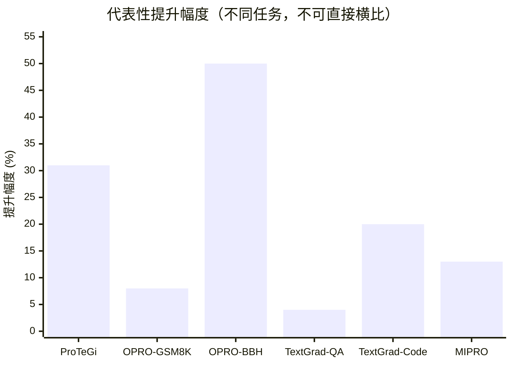
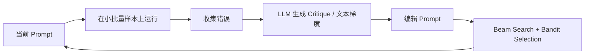
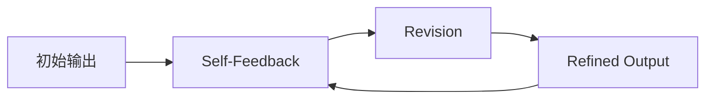
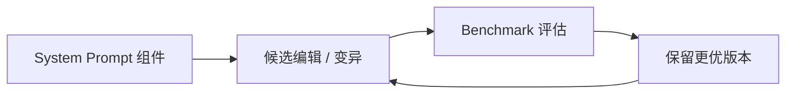
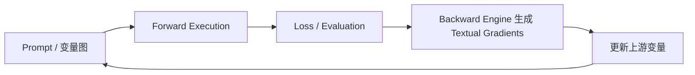
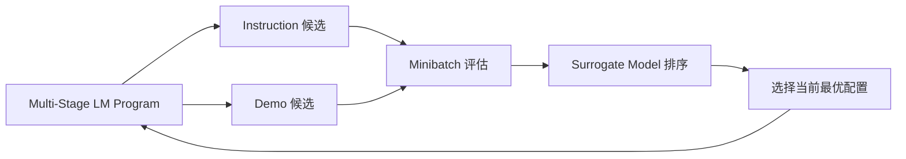

# Prompt 优化文献综述总览

## 综述范围

这份总综述把当前目录里已经收集的 prompt optimization 文献重新整理为一套统一框架，重点覆盖六项内容：

1. prompt 优化策略
2. 每篇论文的最大创新点
3. 指标评估及其计算方式
4. 数据集 / 任务设置
5. benchmark 效果图
6. 每个模型帮助理解的 architecture

这里的目标是形成一版可直接扩展成正式综述章节的“总览稿”。由于这些论文优化对象不同、任务不同、指标也不同，下面的数值图主要用于帮助比较思路，不应被当作严格同口径 leaderboard。

## 文献集合

| 模型 / 论文 | 年份 | 核心优化对象 | 方法类型 |
|---|---:|---|---|
| APE | 2022 | instruction prompt | 生成 + 评估 + 选择 |
| ProTeGi | 2023 | instruction prompt | 文本梯度 + beam search |
| OPRO | 2023 | prompt 或一般候选解 | 基于历史轨迹的 proposal optimization |
| Reflexion | 2023 | agent 行为 / 下一轮上下文 | verbal reinforcement + memory |
| Self-Refine | 2023 | 输出 / 指令修订 | self-critique + iterative refinement |
| SPRIG | 2024 | system prompt | prompt 组件编辑 + evolutionary search |
| TextGrad | 2024 | prompt 及其他文本变量 | textual backpropagation |
| MIPRO | 2024 | 多阶段 instruction + demonstrations | surrogate-guided joint optimization |
| CRITIC | 2024 | 修订输出 / critique 回路 | tool-grounded critique |
| GEPA | 2025 | 复合系统 prompts | reflective evolution + Pareto selection |

## 1. Prompt 优化策略分类

### A. 生成-选择类

- **APE**：先自动生成多组 instructions，再在验证样本上评估，最后保留最优 prompt。
- **SPRIG**：把 system prompt 分解为可编辑组件，通过变异、重组和筛选保留更优版本。

这一类方法把 prompt optimization 主要看成“搜索问题”。

### B. 文本梯度 / critique 驱动编辑类

- **ProTeGi**：从错误样本中生成自然语言“梯度”，再沿语义相反方向修改 prompt。
- **TextGrad**：把自然语言反馈形式化为 textual gradients，并在 computation graph 中回传。
- **Self-Refine**：通过自反馈不断生成、批评、修订。

这一类方法把“语言反馈本身”作为更新信号。

### C. 历史轨迹 / 经验记忆类

- **OPRO**：把历史候选解及其得分写入上下文，让 LLM 直接提出下一轮更优候选。
- **Reflexion**：把过去失败经验转成 verbal memory，供后续轮次调用。
- **GEPA**：根据执行轨迹与反思分析不断演化 prompt。

这一类方法强调：优化信号不只来自当前错误，也来自整个 trajectory。

### D. 多模块 / 系统级优化类

- **MIPRO**：联合优化多阶段 LM program 中每个模块的 instructions 和 few-shot demos。
- **GEPA**：在 compound AI system 层面进行多目标 prompt evolution。
- **TextGrad**：支持跨节点传播 textual feedback，适合复杂系统。

这一类方法适用于“系统里不止一个 prompt”的情形。

### E. 基于验证与证据约束的优化类

- **CRITIC**：不完全信任模型自我批评，而是借助外部工具先验证，再生成 critique。

这一类方法重点解决一个核心问题：反馈可能幻觉化、失真化。

## 2. 每篇论文的最大创新点

| 模型 | 最大创新 |
|---|---|
| APE | 首次较系统地把 prompt engineering 重写为自动生成候选 instruction 并基于表现进行选择的问题。 |
| ProTeGi | 提出自然语言梯度，并结合 beam search 与 bandit selection，让 prompt 编辑变成可执行的自动优化流程。 |
| OPRO | 把 LLM 的角色从“被优化对象”改写为“优化器本身”，以历史得分轨迹作为优化上下文。 |
| Reflexion | 把 reward / failure 转成可复用的 verbal reflection memory，形成跨轮次的语言强化。 |
| Self-Refine | 证明不依赖额外训练，仅靠 generate-critique-revise 回路也能稳定提升结果质量。 |
| SPRIG | 把 system prompt 当成结构化、可编辑对象来优化，而不只优化 task prompt。 |
| TextGrad | 把 backpropagation 的思想推广到不可微的文本系统中，形成 textual backprop 框架。 |
| MIPRO | 针对多阶段 LM program，联合优化 instructions 与 demonstrations，并用 surrogate model 降低搜索成本。 |
| CRITIC | 将 critique 与外部工具证据绑定，提高修正反馈的可靠性，缓解纯自反思的幻觉问题。 |
| GEPA | 用 reflective evolution 和 Pareto-style selection 替代纯 RL 式 prompt optimization，强调反思式进化。 |

## 3. 指标评估及如何计算

这些论文没有统一指标，通常根据任务类型选择不同的 downstream metric。最常见的是下面几类。

### Accuracy

适用于分类、问答、推理等存在明确正确答案的任务。

`Accuracy = 正确预测数量 / 总样本数量`

解释：
- 越高越好
- 最适合单标签、单答案任务

### F1 Score

适用于类别不平衡，或者 precision 和 recall 都很关键的任务。

`Precision = TP / (TP + FP)`

`Recall = TP / (TP + FN)`

`F1 = 2 * Precision * Recall / (Precision + Recall)`

解释：
- 越高越好
- 常见于 offensive language、hate speech、jailbreak detection 等任务

### Relative Improvement

很多论文摘要里用它来概括提升幅度。

`Relative Improvement = (优化后得分 - 基线得分) / 基线得分`

解释：
- 表示相对提升比例
- 不能和“百分点提升”混为一谈

例子：
- baseline accuracy = 50%
- optimized accuracy = 55%
- relative improvement = (55 - 50) / 50 = 10%
- absolute gain = 5 个百分点

### Objective Value / Reward

当任务不是标准分类时，通常直接看目标函数值。

`若越大越好: Improvement = New objective - Old objective`

`若越小越好: Improvement = Old objective - New objective`

例如：
- 回归误差
- TSP 路径长度
- aggregate reward
- simulator score

### 任务特定科学指标

在 TextGrad 这类广义优化论文里，会出现领域指标：

- **QED**：分子药物性质评分，越高越好
- **Vina score**：分子对接评分，越低越好
- **Dose metrics**：放疗计划中的剂量指标

### Program-level Metric

在 MIPRO 这类多模块系统论文里尤其重要：

`Program Score = f(所有模块输出, 最终任务输出)`

解释：
- 优化目标不是某一个局部 prompt 本身
- 而是整个 LM program 的最终下游表现

## 4. 数据集 / 任务设置

这些论文更适合按“任务类型”而不是按“统一 benchmark”来综述。

| 模型 | 当前材料中提到的数据集 / 任务设置 |
|---|---|
| APE | 多种 instruction-sensitive benchmark tasks |
| ProTeGi | sentiment analysis、natural language inference、hate / offensive language detection、jailbreak detection |
| OPRO | GSM8K、BBH，以及 linear regression、TSP 等一般优化任务 |
| Reflexion | agentic coding、reasoning、sequential decision tasks |
| Self-Refine | 多种生成任务上的多轮自反馈 refinement |
| SPRIG | 面向 system prompt 的多任务 benchmark |
| TextGrad | LeetCode-Hard、Google-Proof QA、prompt reasoning、molecule optimization、radiotherapy planning |
| MIPRO | 7 个 multi-stage LM programs |
| CRITIC | code、reasoning、factual generation，以及能进行工具验证的任务 |
| GEPA | 复合 AI 系统中的轨迹驱动 repeated optimization tasks |

### 进一步理解

- **单 prompt 优化代表**：APE、ProTeGi
- **系统级 / 多模块优化代表**：MIPRO、GEPA、TextGrad
- **agent 式迭代改进代表**：Reflexion、Self-Refine、CRITIC
- **一般优化视角代表**：OPRO、TextGrad

## 5. Benchmark 效果图

下面这张图只使用当前笔记里已经明确写出的 headline 数字，作用是帮助快速记忆，不代表严格可横向比较。

### 图中数值含义

- **ProTeGi**：相对初始 prompt 最多提升 31%
- **OPRO 在 GSM8K**：相对人工 prompt 最多提升 8%
- **OPRO 在 BBH**：相对人工 prompt 最多提升 50%
- **TextGrad 在 Google-Proof QA**：accuracy 从 51% 提升到 55%，这里画成 4 个百分点
- **TextGrad 在 LeetCode-Hard**：20% 相对提升
- **MIPRO**：在 7 个 multi-stage programs 中有 5 个超过 baseline，最高 13% accuracy 增益

### 其余模型的定性 benchmark 结论

| 模型 | benchmark 结论 |
|---|---|
| APE | 自动生成 prompts 可达到甚至超过人工 prompts |
| Reflexion | 相比无反思 agent baseline，多轮任务成功率有明显提升 |
| Self-Refine | 相比 one-shot generation，在多任务上持续改进 |
| SPRIG | 仅 system prompt 优化也能带来广泛性能增益 |
| CRITIC | 相比纯自我纠错，基于工具证据的修正更可靠 |
| GEPA | 相比 RL 式 prompt optimization baseline，反思式演化更强 |

## 6. 每个模型帮助理解的 Architecture

下面的图是“帮助理解”的简化版架构，而不是原论文中的精确工程图。

### APE

核心理解：
- 先生成
- 再打分
- 最后选择

### ProTeGi

核心理解：
- 错误样本产生 critique
- critique 决定更新方向
- 搜索机制控制成本与漂移

### OPRO

核心理解：
- 历史轨迹本身就是优化上下文
- LLM 直接负责提出下一轮候选

### Reflexion

核心理解：
- 用语言记住教训
- 让后续尝试不再重复犯错

### Self-Refine

核心理解：
- 同一个模型既当生成器，也当批评者和修订器

### SPRIG

核心理解：
- 把 system prompt 看成可拆、可改、可组合的结构

### TextGrad

核心理解：
- 用文本形式模拟 backpropagation
- 不只适用于 prompt，也适用于 code、solution 等变量

### MIPRO

核心理解：
- 联合优化 instructions 和 few-shot demonstrations
- 用 surrogate 降低多模块系统的全量评估成本

### CRITIC

核心理解：
- critique 需要证据支撑
- 先验证，再修正

### GEPA

核心理解：
- 反思生成更新方向
- 进化选择决定保留哪些 prompt

## 7. 跨论文综合分析

### 不同研究问题最适合引用哪些论文

| 研究问题 | 最适合的论文 | 原因 |
|---|---|---|
| 从零开始自动搜索 prompt | APE、SPRIG | generation-selection 逻辑最清楚 |
| 用 critique 驱动 prompt 更新 | ProTeGi、Self-Refine | 迭代修改链条最直观 |
| 建立“文本反向传播”叙事 | TextGrad | 理论抽象最完整 |
| 让历史得分轨迹直接指导优化 | OPRO | trajectory-based optimization 的代表 |
| 多 prompt / 多模块系统联合优化 | MIPRO、GEPA | 面向 compound system |
| 控制 hallucinated critique | CRITIC | 引入外部工具验证 |
| 跨轮次保留语言型优化记忆 | Reflexion | verbal reinforcement 最典型 |

### 文献中的几个关键设计维度

| 维度 | 低端 | 高端 | 代表论文 |
|---|---|---|---|
| 反馈丰富度 | 只有 scalar score | 有 grounded textual diagnosis | OPRO -> CRITIC |
| 优化范围 | 单 prompt | 整个 multi-stage program | APE -> MIPRO |
| 更新方式 | 搜索 / 选择 | 反向传播式文本更新 | APE -> TextGrad |
| 证据约束 | 纯自反馈 | 工具验证反馈 | Self-Refine -> CRITIC |
| 记忆长度 | 单轮更新 | trajectory / memory 累积 | ProTeGi -> Reflexion / GEPA |

## 8. 写成正式综述时可采用的主线

如果你后面要把这部分扩成正式“prompt 类文献综述”章节，最自然的结构可以是：

1. **从人工 prompt engineering 到自动 prompt search**
   重点写 APE、SPRIG。
2. **从 prompt search 到语言型更新信号**
   重点写 ProTeGi、Self-Refine、TextGrad。
3. **从单 prompt 到 compound AI system**
   重点写 OPRO、MIPRO、GEPA。
4. **从无约束 critique 到证据约束优化**
   重点写 CRITIC、Reflexion。
5. **开放问题**
   prompt drift、hallucinated gradients、evaluation cost、credit assignment、cross-task generalization。

## 9. 直接可用的总结句

- **APE** 是“自动生成并筛选 prompt”的起点型文献。
- **ProTeGi** 是“文本梯度驱动 prompt 编辑”的代表性工作。
- **OPRO** 是“用历史得分轨迹做优化上下文”的代表。
- **TextGrad** 最适合支撑“文本反向传播”这一方法论叙事。
- **MIPRO** 和 **GEPA** 最适合支撑“多模块 / 系统级 prompt optimization”。
- **CRITIC** 对解决反馈幻觉问题最有参考价值。
- **Reflexion** 与 **Self-Refine** 说明语言本身就可以在多轮优化中充当持续更新信号。

