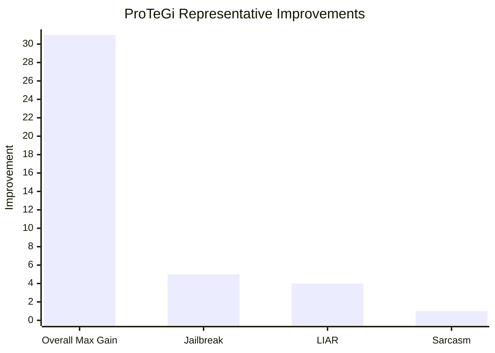

## Prompt Optimization Literature Review: ProTeGi

### Bibliographic Information

- **Title**: Automatic Prompt Optimization with "Gradient Descent" and Beam Search
- **Authors**: Reid Pryzant et al.
- **Year**: 2023
- **Venue**: EMNLP 2023
- **DOI**: 10.18653/v1/2023.emnlp-main.494

### 1. Prompt Optimization Strategy

ProTeGi is a **textual-gradient prompt editing** method. It first runs the current prompt on a minibatch, collects the errors, asks an LLM to summarize what is wrong with the prompt, and then rewrites the prompt in the opposite semantic direction.

Its full strategy includes:

1. minibatch execution
2. error collection
3. natural-language gradient generation
4. prompt rewriting
5. beam search for candidate retention
6. bandit selection for evaluation efficiency

### 2. Biggest Innovation

The biggest innovation of ProTeGi is that it converts prompt updating into a process analogous to **gradient descent in language space**. It uses **language critiques as update directions**, which became highly influential in later prompt-optimization work.

### 3. Metrics and How They Are Computed

Common metrics:

- **Accuracy**

`Accuracy = Number of correct predictions / Total number of examples`

- **F1**

`Precision = TP / (TP + FP)`

`Recall = TP / (TP + FN)`

`F1 = 2 * Precision * Recall / (Precision + Recall)`

- **Relative Improvement**

`Relative Improvement = (Optimized Score - Initial Score) / Initial Score`

### 4. Datasets / Task Setting

ProTeGi is evaluated on **4 concrete classification tasks**, not just loosely described NLP settings:

- **Jailbreak detection**: a new dataset introduced in the paper with **452 multilingual examples** and human-annotated jailbreak labels.
- **Ethos**: **997** English online comments for hate-speech detection.
- **LIAR**: **4,000** statements with context and lie labels for fake-news / truthfulness classification.
- **Sarcasm**: an Arabic sarcasm detection dataset with **10,000** online comments.

Experimental setup details given in the paper:

- **50** examples sampled for development
- **150** examples sampled for test
- results averaged over **3 runs**

### 5. Benchmark Performance Summary

The paper gives both aggregate and task-level evidence:

- Across the four tasks, ProTeGi improves the initial prompt by **up to 31%**.
- It exceeds earlier prompt-learning baselines by about **4-8% on average** while using fewer API calls.
- In the paper's ablation table, beam-search ProTeGi outperforms flat enumeration on several tasks, for example:
  - **Jailbreak**: `0.80 -> 0.85`
  - **LIAR**: `0.63 -> 0.67`
  - **Sarcasm**: `0.87 -> 0.88`
- After 12 rounds of optimization, reported accuracies include:
  - **Ethos**: `0.95`
  - **Sarcasm**: `0.87`
  - **Jailbreak**: `0.81`
  - **LIAR**: `0.64`

| Dataset / Task | Reported Result |
|---|---|
| Overall 4-task study | up to 31% improvement over initial prompt |
| Average vs prior baselines | roughly 4-8% better |
| Jailbreak ablation | 0.80 -> 0.85 |
| LIAR ablation | 0.63 -> 0.67 |
| Sarcasm ablation | 0.87 -> 0.88 |

Note: the first bar is a relative improvement percentage, while the last three bars are absolute score differences from the beam-search ablation table.

### 6. Architecture / Conceptual Understanding

Read ProTeGi as a prompt-editing loop:
- `Search object`: the current prompt text.
- `Feedback signal`: error summaries turned into textual gradients.
- `Key novelty`: gradient descent is translated into natural-language critique plus guided prompt editing.

### 7. Literature Value and Limitations

ProTeGi is a representative paper for **error-to-critique-to-prompt-update** pipelines. Its limitations are that it still depends heavily on critique quality and does not fully solve hallucinated feedback.

