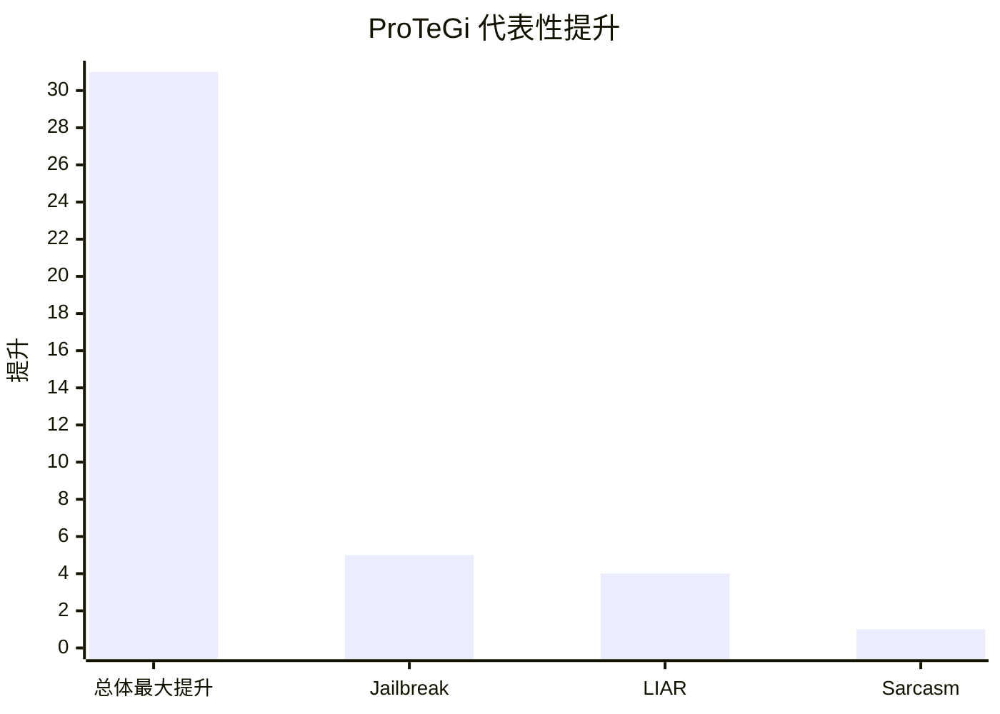

## Prompt 优化文献综述：ProTeGi

### 文献信息

- **题目**：Automatic Prompt Optimization with "Gradient Descent" and Beam Search
- **作者**：Reid Pryzant 等
- **年份**：2023
- **会议**：EMNLP 2023
- **DOI**：10.18653/v1/2023.emnlp-main.494

### 1. Prompt 优化策略

ProTeGi 是典型的 **文本梯度驱动 prompt 编辑** 方法。它先让当前 prompt 在一个 minibatch 上运行，收集错误样本，再让 LLM 总结 prompt 的问题，最后沿“语义相反方向”改写 prompt。

完整优化链条包括：

1. 小批量运行
2. 收集错误
3. 生成自然语言梯度
4. 改写 prompt
5. 用 beam search 保留更优候选
6. 用 bandit selection 降低评估成本

### 2. 最大创新点

ProTeGi 最大的创新在于：它把 prompt 更新过程改写成一种类似 **语言空间中的梯度下降**。虽然它不计算真实数值梯度，但它把 **language critique 当作更新方向**。

### 3. 指标评估及如何计算

常见指标包括：

- **Accuracy**

`Accuracy = 正确预测数 / 总样本数`

- **F1**

`Precision = TP / (TP + FP)`

`Recall = TP / (TP + FN)`

`F1 = 2 * Precision * Recall / (Precision + Recall)`

- **Relative Improvement**

`Relative Improvement = (优化后得分 - 初始得分) / 初始得分`

### 4. 数据集 / 任务设置

ProTeGi 实际上是在 **4 个非常具体的分类任务** 上评估，而不是泛泛的“若干 NLP 任务”：

- **Jailbreak detection**：论文中新引入的数据集，共 **452 个多语言样本**，带有人类标注的 jailbreak 标签。
- **Ethos**：用于 hate-speech detection，共 **997** 条英文在线评论。
- **LIAR**：用于真假陈述分类，共 **4,000** 条 statements，包含上下文与 lie labels。
- **Sarcasm**：阿拉伯语 sarcasm detection 数据集，共 **10,000** 条在线评论。

论文中的实验设置也很具体：

- development set：随机采样 **50** 条
- test set：随机采样 **150** 条
- 所有结果取 **3 次实验平均**

### 5. Benchmark 效果总结

论文既给出了总体结论，也给出了具体任务上的数值表现：

- 在这 4 个任务上，ProTeGi 相比初始 prompt **最高可提升 31%**。
- 相比先前 prompt learning baselines，平均可高出约 **4-8%**，同时调用更少 API。
- 在 beam-search 消融实验中，ProTeGi 对多个任务都有实际数值提升，例如：
  - **Jailbreak**：`0.80 -> 0.85`
  - **LIAR**：`0.63 -> 0.67`
  - **Sarcasm**：`0.87 -> 0.88`
- 在 12 轮优化后，论文表中的代表性 accuracy 还包括：
  - **Ethos**：`0.95`
  - **Sarcasm**：`0.87`
  - **Jailbreak**：`0.81`
  - **LIAR**：`0.64`

| 数据集 / 任务 | 代表性结果 |
|---|---|
| 4 任务总体结论 | 相对初始 prompt 最高提升 31% |
| 相比已有 baseline | 平均高约 4-8% |
| Jailbreak 消融实验 | 0.80 -> 0.85 |
| LIAR 消融实验 | 0.63 -> 0.67 |
| Sarcasm 消融实验 | 0.87 -> 0.88 |

说明：第一根柱子是相对提升百分比；后三根柱子是消融实验里的绝对分数差，因此不是同一量纲，只用于帮助记忆论文里的关键结果。

### 6. Architecture / 帮助理解的结构

把 ProTeGi 看成“用自然语言梯度改 prompt”：
- `搜索对象`：当前 prompt 文本。
- `反馈信号`：错误样例被总结成 textual gradient。
- `核心创新`：把梯度下降思想翻译成“批评 -> 改写 -> 选择”的文本优化闭环。

### 7. 文献价值与局限

ProTeGi 是 **error-to-critique-to-prompt-update** 这一类方法的代表之一。它的局限在于仍高度依赖 critique 质量，也没有彻底解决 hallucinated feedback。
