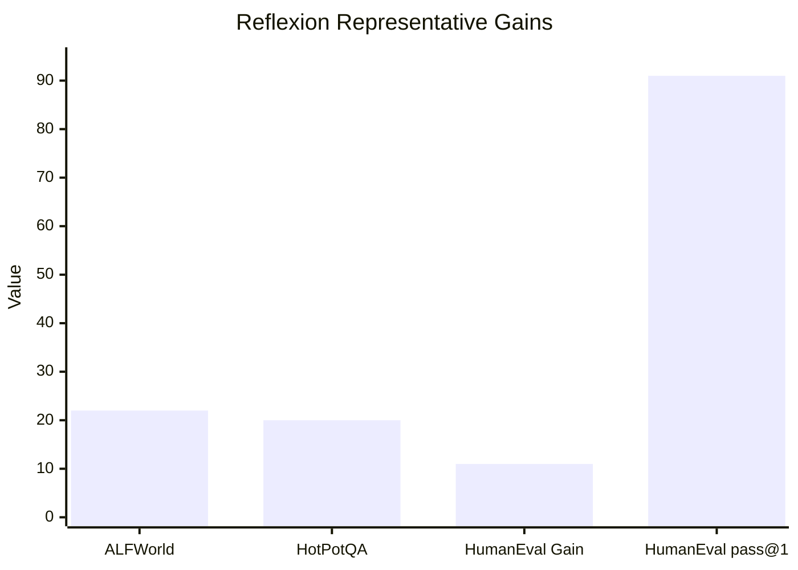

## Prompt Optimization Literature Review: Reflexion

### Bibliographic Information

- **Title**: Reflexion: Language Agents with Verbal Reinforcement Learning
- **Authors**: Shinn et al.
- **Year**: 2023
- **Venue**: NeurIPS 2023
- **Core Topic**: verbal reinforcement learning; reflective memory

### 1. Prompt Optimization Strategy

Reflexion is best described as **memory-based verbal reinforcement**. It converts failed episodes into verbal reflections and stores them as memory that guides later attempts.

Optimization chain:

1. perform an episode
2. evaluate success or failure
3. generate a reflection
4. store the reflection in memory
5. condition the next attempt on that memory

### 2. Biggest Innovation

The biggest innovation is that Reflexion turns **language itself into reinforcement signal storage**.

### 3. Metrics and How They Are Computed

Reflexion mainly uses task success across episodes.

- **Success Rate**

`Success Rate = Successful episodes / Total episodes`

- **pass@1** for code generation

`pass@1 = Number of problems solved on the first attempt / Total number of problems`

### 4. Datasets / Task Setting

Reflexion is evaluated on several clearly identified agentic settings:

- **ALFWorld**: sequential decision-making in text environments; the paper reports results across **134 tasks**.
- **HotPotQA**: multi-hop reasoning / question answering.
- **HumanEval**: code generation benchmark.
- Additional coding benchmarks mentioned in the paper include **MBPP** and **LeetCodeHard**.

This is much more precise than simply saying “coding, reasoning, and sequential tasks.”

### 5. Benchmark Performance Summary

The paper reports several concrete gains:

- On **ALFWorld**, Reflexion improves over strong baseline agents by an **absolute 22%** after iterative learning.
- On **HotPotQA**, Reflexion improves performance by about **20%**.
- On **HumanEval**, Reflexion improves by about **11%** over strong baselines.
- The most headline-grabbing number is that Reflexion reaches **91% pass@1 on HumanEval**, compared with **80%** for the GPT-4 result cited in the paper.

| Benchmark | Baseline / Reference | Reflexion Result |
|---|---|---|
| ALFWorld | strong baseline agents | +22% absolute improvement |
| HotPotQA | strong reasoning baseline | about +20% |
| HumanEval | strong coding baseline | about +11% |
| HumanEval pass@1 | GPT-4 at 80% | Reflexion at 91% |

Note: the first three bars are improvement magnitudes, while the last bar is an achieved pass@1 score.

### 6. Architecture / Conceptual Understanding

The core loop is ?try, reflect, remember, retry?:
- `Optimization target`: future task behavior.
- `Feedback signal`: reward, correctness, or environment feedback.
- `Key novelty`: verbal reflections are stored as memory and reused across attempts.

### 7. Literature Value and Limitations

Reflexion is valuable because it shows how optimization information can be preserved in language memory across rounds. Its limitation is that reflections can still be noisy or misleading.

