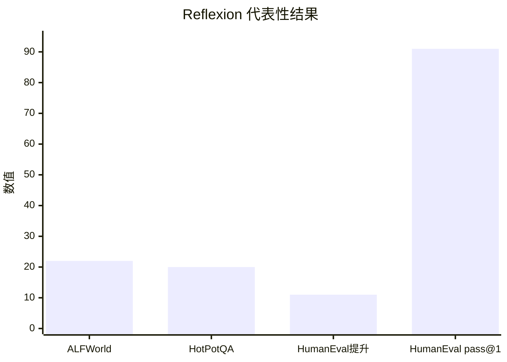

## Prompt 优化文献综述：Reflexion

### 文献信息

- **题目**：Reflexion: Language Agents with Verbal Reinforcement Learning
- **作者**：Shinn 等
- **年份**：2023
- **会议**：NeurIPS 2023
- **核心主题**：verbal reinforcement learning；reflective memory

### 1. Prompt 优化策略

Reflexion 更准确地说是 **基于记忆的 verbal reinforcement**。它把失败回合转成 verbal reflections，再把这些反思写入 memory，指导后续尝试。

优化链条是：

1. 执行一轮任务
2. 判断成功或失败
3. 生成 reflection
4. 把 reflection 存入 memory
5. 下一轮在 memory 条件下继续尝试

### 2. 最大创新点

Reflexion 最大的创新在于：它把 **语言本身变成 reinforcement signal 的存储介质**。

### 3. 指标评估及如何计算

Reflexion 主要看多轮 episode 中的任务成功率。

- **Success Rate**

`Success Rate = 成功 episodes 数 / 总 episodes 数`

- **pass@1**（代码任务）

`pass@1 = 首次尝试即成功的问题数 / 总问题数`

### 4. 数据集 / 任务设置

Reflexion 论文中的实验设置其实很具体：

- **ALFWorld**：文本环境中的 sequential decision-making，论文中展示了 **134 个任务** 上的结果。
- **HotPotQA**：multi-hop reasoning / question answering。
- **HumanEval**：代码生成 benchmark。
- 论文中还提到其他代码 benchmark，如 **MBPP** 和 **LeetCodeHard**。

因此，这里应写成具体 benchmark 名称，而不是笼统说“coding、reasoning、sequential tasks”。

### 5. Benchmark 效果总结

Reflexion 报告了几个非常具体的结果：

- 在 **ALFWorld** 上，相比强 baseline agent，Reflexion 有 **22% 的绝对提升**。
- 在 **HotPotQA** 上，性能提升约 **20%**。
- 在 **HumanEval** 上，相比强 baseline 提升约 **11%**。
- 最醒目的 headline 结果是：Reflexion 在 **HumanEval** 上达到 **91% pass@1**，而论文对照的 GPT-4 结果是 **80%**。

| Benchmark | 基线 / 对照 | Reflexion 结果 |
|---|---|---|
| ALFWorld | 强 baseline agents | 绝对提升 22% |
| HotPotQA | 强 reasoning baseline | 提升约 20% |
| HumanEval | 强 coding baseline | 提升约 11% |
| HumanEval pass@1 | GPT-4 为 80% | Reflexion 达到 91% |

说明：前三根柱子表示提升幅度，最后一根柱子表示最终达到的 pass@1 分数，因此量纲并不相同。

### 6. Architecture / 帮助理解的结构

它的核心闭环是“先试，再反思，再记住，再重试”：
- `优化对象`：下一轮任务行为，而不是单次静态 prompt。
- `反馈信号`：reward、正确率或环境反馈。
- `核心创新`：把 verbal reflection 存成 memory，并在后续尝试中复用。

### 7. 文献价值与局限

Reflexion 的价值在于证明：优化信息可以通过语言记忆跨轮次保存。它的局限是 reflection 本身仍可能有噪声甚至误导。
