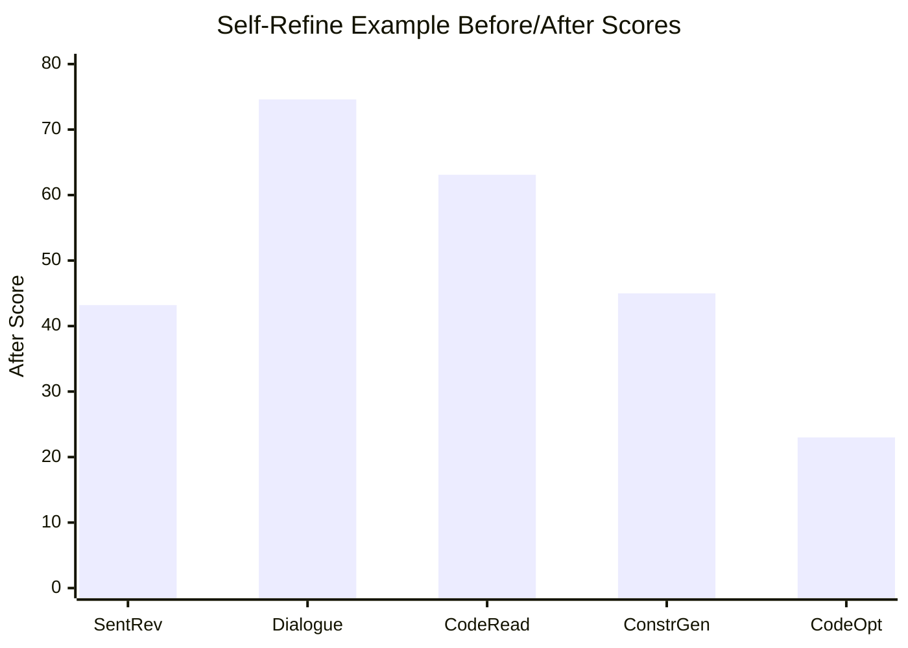

## Prompt Optimization Literature Review: Self-Refine

### Bibliographic Information

- **Title**: Self-Refine: Iterative Refinement with Self-Feedback
- **Authors**: Madaan et al.
- **Year**: 2023
- **Venue**: NeurIPS 2023
- **Core Topic**: self-feedback; iterative revision

### 1. Prompt Optimization Strategy

Self-Refine uses a compact textual optimization loop:

1. generate
2. critique
3. revise
4. repeat

Although it is often discussed at the output level, the same logic can be used to refine instructions or response policies.

### 2. Biggest Innovation

Its biggest innovation is showing how much improvement can come from a **minimal self-feedback loop** without extra training or complicated search machinery.

### 3. Metrics and How They Are Computed

Metrics depend on the task. The paper uses task-specific metrics such as:

- task accuracy / solve rate
- pairwise preference rate
- code-quality metrics
- human evaluation scores

Common abstract forms include:

`Accuracy = Correct outputs / Total outputs`

`Relative Improvement = (Refined - Initial) / Initial`

### 4. Datasets / Task Setting

Self-Refine is evaluated on **7 concrete tasks**, not just a generic set of generation problems:

- **Sentiment Reversal**: 1,000 review passages
- **Dialogue Response Generation**: **FED** dataset with **372** conversations
- **Code Optimization**: **1,000** programs
- **Code Readability Improvement**
- **Math Reasoning**: **GSM8K** with **1,319** questions
- **Acronym Generation**: **250** acronym examples
- **Constrained Generation**: **CommonGen-Hard** with **200** samples

This makes Self-Refine one of the easier papers in the folder to summarize rigorously, because its task table is explicit.

### 5. Benchmark Performance Summary

The paper reports concrete task-level gains rather than only a broad “it improves quality” claim:

- Across the 7 tasks, outputs refined by Self-Refine are preferred over one-shot generation, with an average gain of about **20% absolute**.
- The paper also states **5-40% absolute improvement** depending on task and model.
- On code-generation / optimization settings, gains can reach **up to 13% absolute** over strong base models.
- Table 1 gives concrete examples:
  - **Sentiment Reversal** with ChatGPT: `11.4 -> 43.2` (`+31.8`)
  - **Dialogue Response** with GPT-4: `25.4 -> 74.6` (`+49.2`)
  - **Code Readability** with ChatGPT: `27.7 -> 63.1` (`+35.4`)
  - **Constrained Generation** with GPT-4: `15.0 -> 45.0` (`+30.0`)
  - **Code Optimization** with GPT-3.5: `14.8 -> 23.0` (`+8.2`)
  - **Math Reasoning** sees only tiny gains without oracle error signals: e.g. `74.8 -> 75.0`

| Task / Model Example | Base | + Self-Refine |
|---|---:|---:|
| Sentiment Reversal / ChatGPT | 11.4 | 43.2 |
| Dialogue Response / GPT-4 | 25.4 | 74.6 |
| Code Readability / ChatGPT | 27.7 | 63.1 |
| Constrained Generation / GPT-4 | 15.0 | 45.0 |
| Code Optimization / GPT-3.5 | 14.8 | 23.0 |

### 6. Architecture / Conceptual Understanding

This is the simplest self-improvement loop in the set:
- `Optimization target`: the current output draft.
- `Feedback signal`: self-generated critique from the same model or role setup.
- `Key novelty`: generation, critique, and revision are kept in one lightweight iterative framework.

### 7. Literature Value and Limitations

Self-Refine is valuable as a **simple baseline for textual improvement loops**. Its main limitation is that self-feedback may be shallow or ungrounded; the paper itself shows that some tasks, such as math reasoning, need stronger external error signals to obtain large gains.

