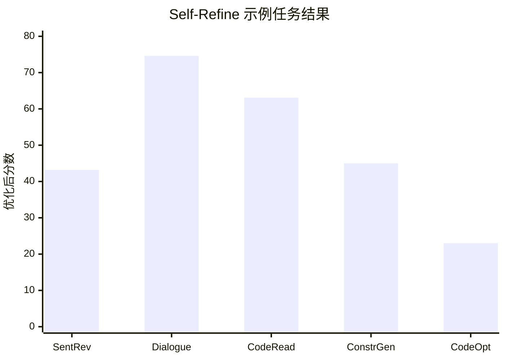

## Prompt 优化文献综述：Self-Refine

### 文献信息

- **题目**：Self-Refine: Iterative Refinement with Self-Feedback
- **作者**：Madaan 等
- **年份**：2023
- **会议**：NeurIPS 2023
- **核心主题**：self-feedback；iterative revision

### 1. Prompt 优化策略

Self-Refine 使用的是一个紧凑的文本优化回路：

1. generate
2. critique
3. revise
4. repeat

虽然它经常被讨论为输出层面的改写方法，但同样可以迁移到 instruction 或 response policy 的优化上。

### 2. 最大创新点

它最大的创新在于：证明了即使没有额外训练、没有复杂搜索机制，一个 **极简的 self-feedback 回路** 也能带来明显提升。

### 3. 指标评估及如何计算

Self-Refine 依任务使用不同指标，主要包括：

- task accuracy / solve rate
- pairwise preference rate
- code-quality metrics
- human evaluation scores

抽象写法可包括：

`Accuracy = 正确输出数 / 总输出数`

`Relative Improvement = (修订后 - 初始) / 初始`

### 4. 数据集 / 任务设置

Self-Refine 实际评估在 **7 个非常具体的任务** 上，而不是泛泛的“多种生成任务”：

- **Sentiment Reversal**：**1,000** 条 review passages
- **Dialogue Response Generation**：**FED** 数据集，共 **372** 段对话
- **Code Optimization**：**1,000** 个程序
- **Code Readability Improvement**
- **Math Reasoning**：**GSM8K**，共 **1,319** 道题
- **Acronym Generation**：**250** 个 acronym 样本
- **Constrained Generation**：**CommonGen-Hard**，共 **200** 个样本

因此，这篇论文在“任务设置”上其实非常适合写得具体。

### 5. Benchmark 效果总结

Self-Refine 给出的不是模糊结论，而是相当具体的任务级数值：

- 在 7 个任务整体上，Self-Refine 相比 one-shot generation 平均约有 **20% 的绝对提升**。
- 论文还总结为：不同任务和模型下，提升通常落在 **5-40% 绝对提升** 区间。
- 在代码相关任务上，提升可达到 **最高 13% 绝对提升**。
- Table 1 中一些非常具体的结果包括：
  - **Sentiment Reversal / ChatGPT**：`11.4 -> 43.2`（`+31.8`）
  - **Dialogue Response / GPT-4**：`25.4 -> 74.6`（`+49.2`）
  - **Code Readability / ChatGPT**：`27.7 -> 63.1`（`+35.4`）
  - **Constrained Generation / GPT-4**：`15.0 -> 45.0`（`+30.0`）
  - **Code Optimization / GPT-3.5**：`14.8 -> 23.0`（`+8.2`）
  - **Math Reasoning** 在没有 oracle error signal 时提升很小，例如 `74.8 -> 75.0`

| 任务 / 模型示例 | Base | + Self-Refine |
|---|---:|---:|
| Sentiment Reversal / ChatGPT | 11.4 | 43.2 |
| Dialogue Response / GPT-4 | 25.4 | 74.6 |
| Code Readability / ChatGPT | 27.7 | 63.1 |
| Constrained Generation / GPT-4 | 15.0 | 45.0 |
| Code Optimization / GPT-3.5 | 14.8 | 23.0 |

### 6. Architecture / 帮助理解的结构

这组方法里它是最轻量的自改闭环：
- `优化对象`：当前输出草稿。
- `反馈信号`：模型自己生成的批评意见。
- `核心创新`：把生成、批评、改写压缩进同一个简洁迭代框架。

### 7. 文献价值与局限

Self-Refine 的价值在于它是 **文本迭代改进回路的极简基线**。它的局限是 self-feedback 可能较浅层，也可能缺乏 grounding；论文本身也显示，像数学推理这类任务如果没有更强的外部错误信号，提升会比较有限。
