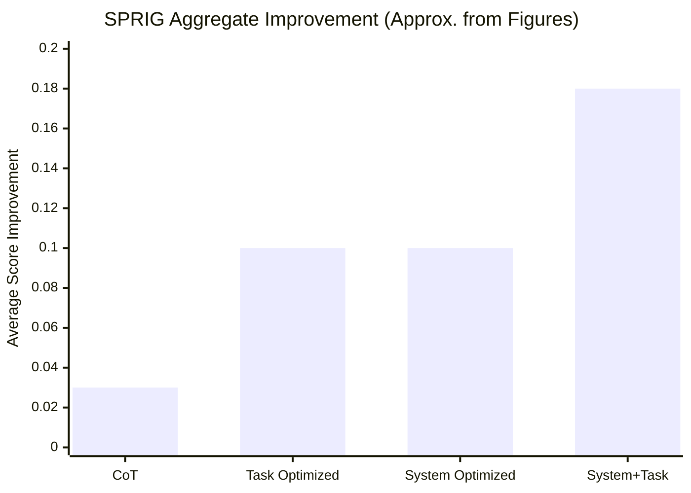

## Prompt Optimization Literature Review: SPRIG

### Bibliographic Information

- **Title**: SPRIG: Improving Large Language Model Performance by System Prompt Optimization
- **Authors**: Zhang et al.
- **Year**: 2024
- **Venue**: arXiv preprint
- **Core Topic**: system prompt optimization; prompt component editing

### 1. Prompt Optimization Strategy

SPRIG focuses specifically on **system prompt optimization**. It treats the system prompt as a structured object whose components can be edited, recombined, and searched over iteratively.

### 2. Biggest Innovation

The biggest innovation of SPRIG is that it isolates the **system prompt layer** as a first-class optimization target.

### 3. Metrics and How They Are Computed

SPRIG uses three concrete evaluation metrics depending on task type:

- **Accuracy** for most benchmarks
- **F1** for imbalanced classification tasks
- **BLEU_accuracy** for open-ended generation tasks

The paper normalizes these bounded metrics and reports an aggregated **Average Score** across tasks:

`Average Score = mean(normalized task metrics across the benchmark suite)`

### 4. Datasets / Task Setting

SPRIG is evaluated on a much more concrete benchmark suite than “many tasks”:

- a **47-task benchmark collection** spanning multiple models, languages, and task types
- the main English benchmark analyzes **42 tasks** grouped into **7 categories**:
  - reasoning
  - math
  - social understanding
  - commonsense
  - faithfulness
  - knowledge
  - language understanding
- representative English benchmarks include:
  - **MMLU**
  - **BBH**
  - **TruthfulQA**
  - **SocKET** social-understanding tasks
- multilingual transfer is tested on:
  - **MGSM**
  - **BELEBELE**
  - **XCOPA**
  - **M3EXAM**
  - **M-MMLU**

The paper also states that benchmark splits are **40% train / 20% dev / 40% test**.

### 5. Benchmark Performance Summary

SPRIG provides more than a vague “broad improvement” claim:

- In the main aggregate comparison (Figure 3), **system-prompt optimization with SPRIG consistently improves Average Score over the unoptimized baseline and over simple CoT prompting**.
- In the same figure, **System+Task optimization (SPRIG + ProTeGi)** gives the strongest overall result, reaching roughly **0.15-0.20 Average Score Improvement** depending on model.
- Figure 7 shows that **SPRIG alone surpasses prior methods particularly in math, faithfulness, and language-understanding categories**.
- Figure 9 shows that on multilingual transfer benchmarks (**MGSM, BELEBELE, XCOPA, M3EXAM, M-MMLU**), **SPRIG-optimized English system prompts generalize much better than ProTeGi-style task prompts**.
- Figure 15 reports cross-model system-prompt transfer gains typically in the **0.08-0.13 Average Score Improvement** range.

| Evaluation Slice | SPRIG Finding |
|---|---|
| Main benchmark suite | clearly above unoptimized baseline and CoT |
| System vs task optimization | system optimization is on par with task-level prompt optimization |
| System + task optimization | strongest overall, about 0.15-0.20 Average Score Improvement |
| Multilingual transfer | clearly stronger than ProTeGi on MGSM / BELEBELE / XCOPA / M3EXAM / M-MMLU |

Note: these values are approximate visual summaries from the paper's aggregate figures, included here to avoid the earlier vague wording.

### 6. Architecture / Conceptual Understanding

Read SPRIG as component-level prompt search:
- `Search object`: decomposed system-prompt pieces rather than one monolithic prompt.
- `Feedback signal`: benchmark performance after each edit.
- `Key novelty`: prompt optimization operates over reusable components, which improves controllability.

### 7. Literature Value and Limitations

SPRIG is useful because it reminds us that prompt optimization should not focus only on task instructions. Its limitation is that it remains largely a search framework and does not by itself provide grounded critique.

