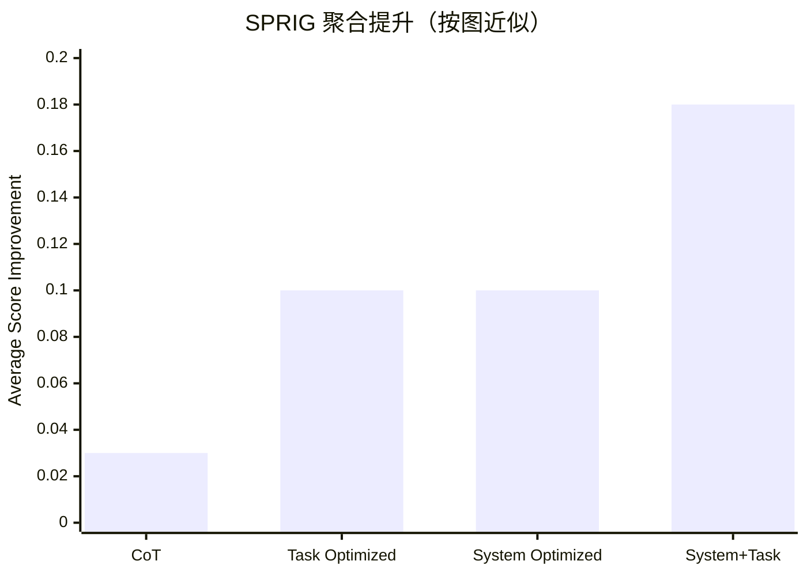

## Prompt 优化文献综述：SPRIG

### 文献信息

- **题目**：SPRIG: Improving Large Language Model Performance by System Prompt Optimization
- **作者**：Zhang 等
- **年份**：2024
- **发表形式**：arXiv preprint
- **核心主题**：system prompt optimization；prompt component editing

### 1. Prompt 优化策略

SPRIG 专门关注 **system prompt optimization**。它把 system prompt 当作一个结构化对象，认为其中不同组件都可以被编辑、重组和搜索。

### 2. 最大创新点

SPRIG 最大的创新在于：它把 **system prompt 这一层** 提升为一级优化对象。

### 3. 指标评估及如何计算

SPRIG 并不是只用一个笼统指标，而是根据任务类型使用三类具体指标：

- 大多数任务使用 **Accuracy**
- 标签不平衡分类任务使用 **F1**
- 开放生成任务使用 **BLEU_accuracy**

然后论文将这些有界指标统一汇总为一个聚合指标 **Average Score**：

`Average Score = 各任务归一化指标的平均值`

### 4. 数据集 / 任务设置

SPRIG 的评测远比“many tasks”更具体：

- 构建了一个 **47-task benchmark collection**，覆盖不同模型、语言和任务类型
- 主体英文 benchmark 分析了 **42 个任务**，分属 **7 个类别**：
  - reasoning
  - math
  - social understanding
  - commonsense
  - faithfulness
  - knowledge
  - language understanding
- 代表性英文 benchmark 包括：
  - **MMLU**
  - **BBH**
  - **TruthfulQA**
  - **SocKET** 系列 social-understanding 任务
- 多语言迁移评估使用：
  - **MGSM**
  - **BELEBELE**
  - **XCOPA**
  - **M3EXAM**
  - **M-MMLU**

论文还明确说明 benchmark split 为 **40% train / 20% dev / 40% test**。

### 5. Benchmark 效果总结

SPRIG 不是简单地“在很多任务上更强”，而是有比较明确的结果结构：

- 在主 aggregate 比较（Figure 3）中，**SPRIG 的 system-prompt optimization 明显优于未优化 baseline 和简单 CoT**。
- 在同一图中，**System+Task optimization（SPRIG + ProTeGi）** 是最强组合，Average Score Improvement 大约达到 **0.15-0.20**。
- Figure 7 显示，**SPRIG 单独在 math、faithfulness、language-understanding 等类别上尤其突出**。
- Figure 9 显示，在多语言迁移 benchmark（**MGSM、BELEBELE、XCOPA、M3EXAM、M-MMLU**）上，**SPRIG 优化出的英文 system prompts 比 ProTeGi 风格 task prompts 泛化更好**。
- Figure 15 的 cross-model transfer 结果显示，优化后的 system prompt 跨模型迁移增益通常落在 **0.08-0.13 Average Score Improvement** 区间。

| 评估切片 | SPRIG 结论 |
|---|---|
| 主 benchmark suite | 明显优于 unoptimized baseline 和 CoT |
| system vs task optimization | system optimization 基本可与 task-level optimization 持平 |
| system + task optimization | 最强，总体约 0.15-0.20 Average Score Improvement |
| multilingual transfer | 在 MGSM / BELEBELE / XCOPA / M3EXAM / M-MMLU 上明显强于 ProTeGi |

说明：这里的数值是根据论文聚合图做的近似可视化，目的是避免之前那种只有“broad improvement”但没有任何量化参照的写法。

### 6. Architecture / 帮助理解的结构

把 SPRIG 看成“在组件层面搜 prompt”：
- `搜索对象`：被拆开的 system-prompt 组件，而不是整段不可分文本。
- `反馈信号`：每轮编辑后的 benchmark 表现。
- `核心创新`：优化单位变成可复用组件，因此可控性比整段改写更强。

### 7. 文献价值与局限

SPRIG 的价值在于提醒我们：prompt optimization 不应只盯着 task instruction。它的局限在于本质上仍偏搜索框架，并没有直接提供 grounded critique。
