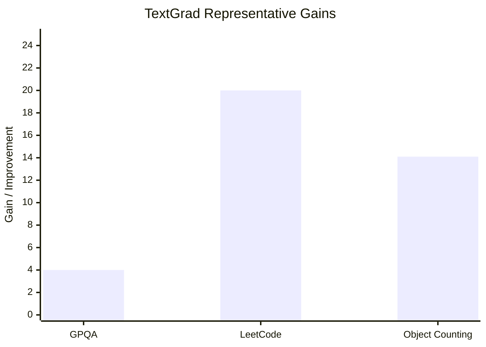

## Prompt Optimization Literature Review: TextGrad

### Bibliographic Information

- **Title**: TextGrad: Automatic "Differentiation" via Text
- **Authors**: Mert Yuksekgonul, Federico Bianchi, Joseph Boen, Sheng Liu, Zhi Huang, Carlos Guestrin, James Zou
- **Year**: 2024
- **Venue**: arXiv preprint
- **DOI**: 10.48550/arXiv.2406.07496

### 1. Prompt Optimization Strategy

TextGrad is a **textual backpropagation framework**. It represents a compound AI system as a computation graph, treats prompts or other textual objects as variables, and uses LLM-generated textual feedback as the analogue of gradients.

The optimization loop is:
1. define a variable to optimize, such as a prompt, solution, code snippet, or molecule representation
2. run the forward computation graph
3. evaluate the downstream output with a loss or scorer
4. backpropagate textual feedback through the graph
5. update the textual variable with a Textual Gradient Descent step

### 2. Biggest Innovation

The biggest innovation of TextGrad is that it extends the logic of **automatic differentiation** to **non-differentiable textual systems**. Instead of numerical gradients, it uses natural-language criticism as “textual gradients”.

### 3. Metrics and How They Are Computed

TextGrad is intentionally broad, so it uses task-specific downstream metrics. The paper reports all of the following:
- **Accuracy** for QA and reasoning tasks
- **Completion Rate** for coding tasks
- **QED** for molecule drug-likeness
- **Vina score** for molecular docking
- dose and plan-quality metrics for radiotherapy planning

Typical formulas include:

`Accuracy = Number of correct instances / Total number of instances`

For coding, the paper uses **Completion Rate**, i.e. whether the generated code passes all test cases.

For molecules:
- **QED**: higher is better
- **Vina score**: lower is better

### 4. Datasets / Task Setting

TextGrad is evaluated across several domains.

For **coding**:
- **LeetCode Hard**

For **question answering / problem solving**:
- **Google-Proof QA (GPQA)**
- **MMLU-Machine Learning**
- **MMLU-College Physics**

For **prompt optimization for reasoning**:
- **Object Counting** from BBH
- **Word Sorting** from BBH
- **GSM8K**

The paper gives concrete prompt-optimization splits:
- Object Counting / Word Sorting: **50 train / 100 validation / 100 test**
- GSM8K: **200 train / 300 validation / 1319 test**

For prompt optimization, the paper optimizes a **single system prompt** for `gpt-3.5-turbo-0125`, while using `gpt-4o` as the gradient engine.

### 5. Benchmark Performance Summary

TextGrad reports representative gains across multiple domains.

#### Problem solving / QA (`Table 2`)

| Dataset | Baseline | TextGrad |
|---|---|---:|
| Google-Proof QA | CoT = 51.0 | **55.0** |
| MMLU-Machine Learning | CoT = 85.7 | **88.4** |
| MMLU-College Physics | CoT = 91.2 | **95.1** |

So the often-quoted GPQA result is concretely **51% -> 55%**, and the MMLU subsets also improve by several points.

#### Coding (`Table 1`)

| Method | Completion Rate |
|---|---:|
| Zero-shot baseline | 0.26 |
| Reflexion (1 demonstration, 5 iterations) | 0.31 ± 0.012 |
| **TEXTGRAD (0 demonstrations, 5 iterations)** | **0.36 ± 0.018** |

This is where the paper’s “20% relative performance gain” comes from: TextGrad improves over the prior strong baseline Reflexion while remaining zero-shot in demonstrations.

#### Prompt optimization for reasoning (`Table 3`)

| Dataset | CoT (0-shot) | DSPy BFSR | TextGrad |
|---|---:|---:|---:|
| Object Counting | 77.8 | 84.9 | **91.9** |
| Word Sorting | 76.7 | **79.8** | **79.8** |
| GSM8K | 72.9 | **81.1** | **81.1** |

These numbers are much more precise than saying only that TextGrad “improves prompts”:
- on **Object Counting**, TextGrad is best and improves over DSPy by **7.0 points**
- on **Word Sorting** and **GSM8K**, it matches DSPy while using a different optimization mechanism

### 6. Architecture / Conceptual Understanding

The paper should be read as a text-native analog of autodiff:
- `Optimization target`: prompts, answers, code, or other text variables.
- `Feedback signal`: textual loss plus backward-generated critique.
- `Key novelty`: the framework mimics forward / backward optimization while keeping variables in natural language.

### 7. Literature Value and Limitations

TextGrad is extremely valuable because it provides a **general optimization abstraction** for compound AI systems. It is not limited to prompt rewriting; it can optimize prompts, solutions, code, molecules, and even treatment-plan parameters.

Its main limitation is that once feedback becomes natural language, the framework must still deal with grounding, faithfulness, and hallucination control. So the abstraction is powerful, but it does not automatically solve reliability of the textual gradient itself.

