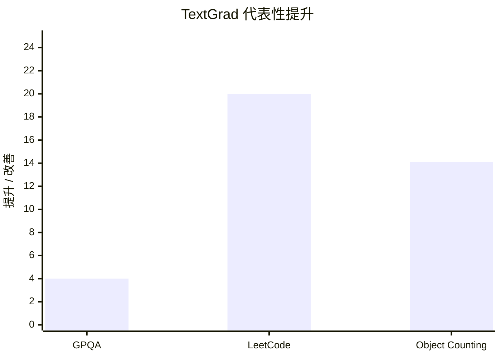

## Prompt 优化文献综述：TextGrad

### 文献信息

- **题目**：TextGrad: Automatic "Differentiation" via Text
- **作者**：Mert Yuksekgonul, Federico Bianchi, Joseph Boen, Sheng Liu, Zhi Huang, Carlos Guestrin, James Zou
- **年份**：2024
- **发表形式**：arXiv preprint
- **DOI**：10.48550/arXiv.2406.07496

### 1. Prompt 优化策略

TextGrad 是一个 **文本反向传播框架**。它把复合 AI 系统表示成 computation graph，把 prompt 或其他文本对象当作变量，再把 LLM 生成的 textual feedback 当作“梯度类比物”。

优化流程可以概括为：
1. 定义要优化的变量，例如 prompt、solution、code snippet 或 molecule 表达
2. 执行 forward computation graph
3. 用 loss 或 scorer 对下游输出打分
4. 通过 computation graph 反向传播 textual feedback
5. 用 Textual Gradient Descent 更新文本变量

### 2. 最大创新点

TextGrad 最大的创新在于：它把 **automatic differentiation** 的思想扩展到了 **不可微的文本系统**。这里传递的不是数值梯度，而是自然语言形式的“textual gradients”。

### 3. 指标评估及如何计算

由于 TextGrad 覆盖的任务很多，它使用的是 **任务特定的下游指标**。论文中明确报告了：
- **Accuracy**：用于 QA 和 reasoning 任务
- **Completion Rate**：用于 coding
- **QED**：用于分子药物性
- **Vina score**：用于分子 docking
- radiotherapy planning 的 dose / plan-quality 指标

常见公式包括：

`Accuracy = 正确样本数 / 总样本数`

对于 coding，论文使用 **Completion Rate**，即代码是否通过全部测试用例。

对于分子优化：
- **QED**：越高越好
- **Vina score**：越低越好

### 4. 数据集 / 任务设置

TextGrad 覆盖多个领域。

在 **coding** 中：
- **LeetCode Hard**

在 **question answering / problem solving** 中：
- **Google-Proof QA (GPQA)**
- **MMLU-Machine Learning**
- **MMLU-College Physics**

在 **prompt optimization for reasoning** 中：
- BBH 的 **Object Counting**
- BBH 的 **Word Sorting**
- **GSM8K**

论文对 prompt optimization 给了明确 split：
- Object Counting / Word Sorting：**50 train / 100 validation / 100 test**
- GSM8K：**200 train / 300 validation / 1319 test**

对于 prompt optimization，论文优化的是 `gpt-3.5-turbo-0125` 的 **单个 system prompt**，而 `gpt-4o` 负责在 backward 阶段生成 textual feedback。

### 5. Benchmark 效果总结

TextGrad 在多个任务上都给出了具体数值。

#### Problem solving / QA（`Table 2`）

| 数据集 | Baseline | TextGrad |
|---|---|---:|
| Google-Proof QA | CoT = 51.0 | **55.0** |
| MMLU-Machine Learning | CoT = 85.7 | **88.4** |
| MMLU-College Physics | CoT = 91.2 | **95.1** |

所以，常被引用的 GPQA 结果可以更严谨地写成：**51% -> 55%**，而且 MMLU 两个子集也分别提升了数个点。

#### Coding（`Table 1`）

| 方法 | Completion Rate |
|---|---:|
| Zero-shot baseline | 0.26 |
| Reflexion（1 demonstration, 5 iterations） | 0.31 ± 0.012 |
| **TEXTGRAD（0 demonstrations, 5 iterations）** | **0.36 ± 0.018** |

这正是论文里“20% relative performance gain”的来源：TextGrad 在不使用 demonstrations 的情况下，超过了当时很强的 Reflexion baseline。

#### Prompt optimization for reasoning（`Table 3`）

| 数据集 | CoT (0-shot) | DSPy BFSR | TextGrad |
|---|---:|---:|---:|
| Object Counting | 77.8 | 84.9 | **91.9** |
| Word Sorting | 76.7 | **79.8** | **79.8** |
| GSM8K | 72.9 | **81.1** | **81.1** |

这些数值比“TextGrad 会改 prompt”更有说服力：
- 在 **Object Counting** 上，TextGrad 最优，并比 DSPy 高 **7.0 个点**
- 在 **Word Sorting** 和 **GSM8K** 上，TextGrad 与 DSPy 持平，但优化机制不同

### 6. Architecture / 帮助理解的结构

最好的读法是“自然语言版 autodiff”：
- `优化对象`：prompt、答案、代码等文本变量。
- `反馈信号`：textual loss 以及 backward 阶段生成的批评信息。
- `核心创新`：形式上模仿 forward / backward 优化，但被更新的对象始终是自然语言变量。

### 7. 文献价值与局限

TextGrad 的价值非常高，因为它提供了一个 **通用优化抽象**：不仅能改 prompt，还能改 solution、code、molecule，甚至治疗计划参数。

它的主要局限是：一旦反馈变成自然语言，grounding、faithfulness、hallucination control 这些问题就会立刻出现。所以它的抽象非常强，但并不自动解决 textual gradient 本身的可靠性问题。
